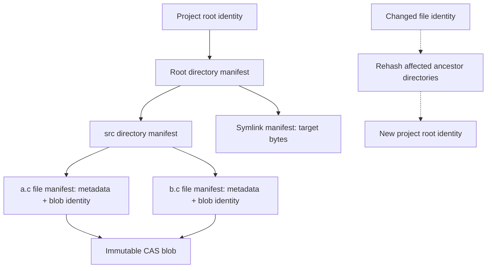
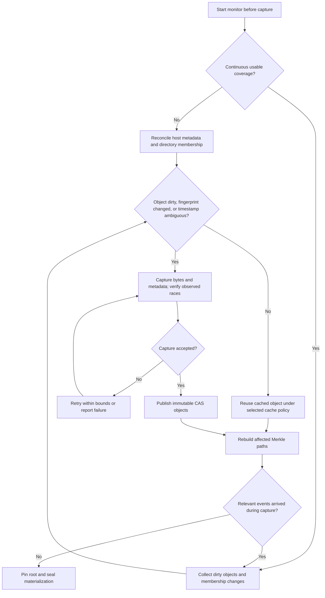
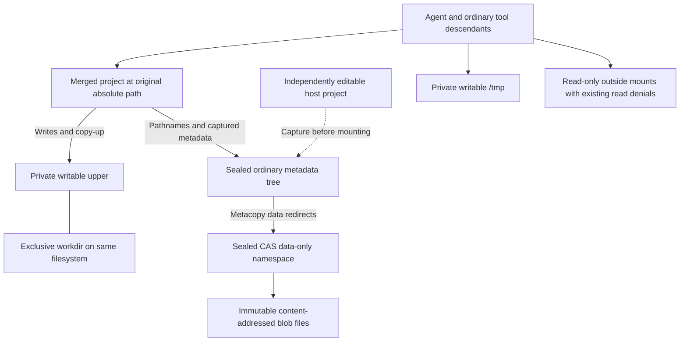
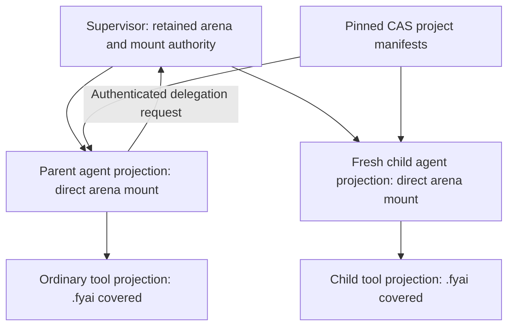
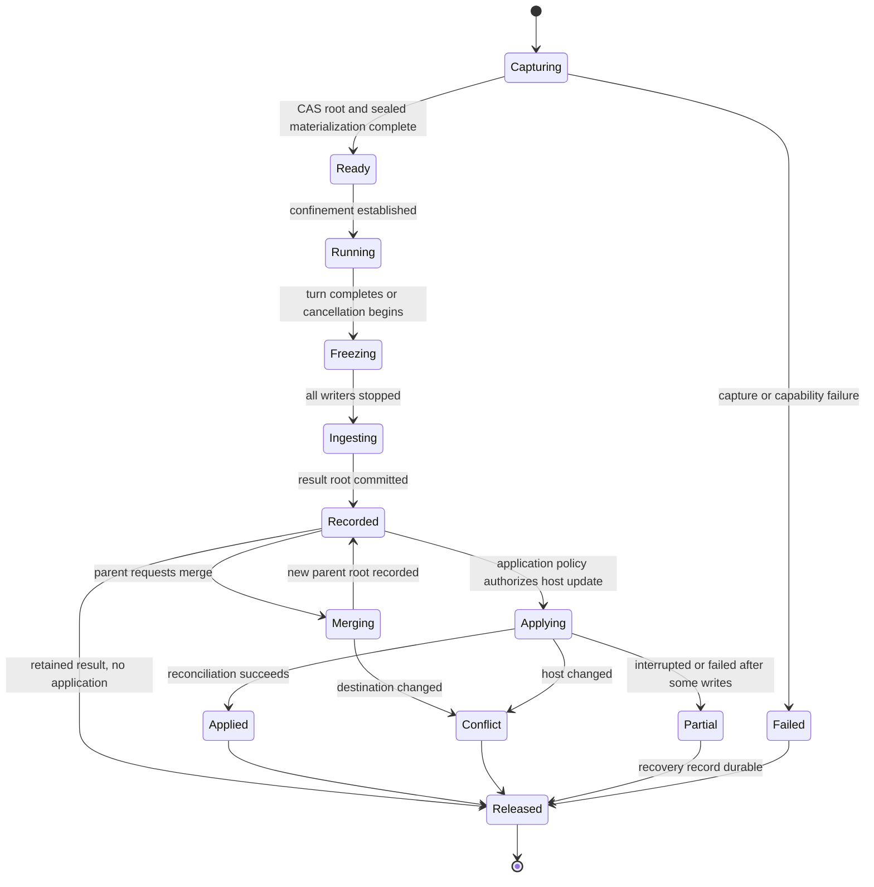
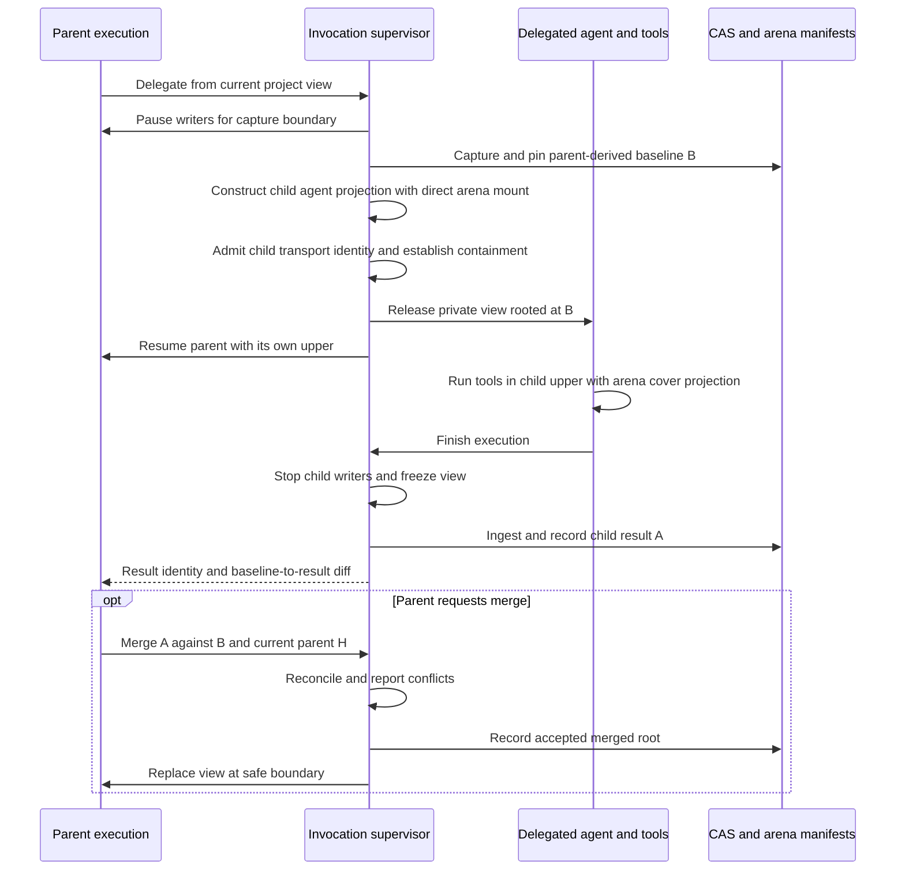
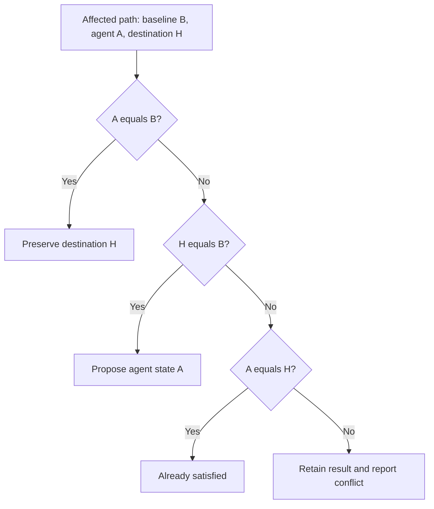
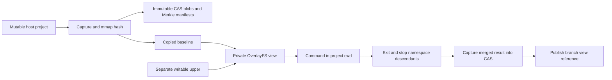

# Software Design Document: agent project filesystem transactions

**Status:** Proposed; implementation and capability validation pending
**Scope:** Linux project-directory views for one fyai invocation and its agents
**Related design:** [Agent transport isolation](agent-transport-isolation-sdd.md)

## 1. Purpose and decisions

Give an agent a writable project view backed by an immutable captured project
state. The user and unrelated host processes may continue editing the host
project while the agent runs. Agent writes do not reach that project until a
separate host-application step reconciles them.

The agreed design uses native OverlayFS over ordinary directories, immutable
content-addressed file blobs, and a Merkle directory tree. It does not build an
EROFS, Composefs, or other filesystem image. The backing project tree is fully
populated before the turn starts and remains unchanged while mounted. Only the
private upper changes during execution. Consequently, file-open interception
is not needed to capture the baseline. Change notifications optimize subsequent
capture; they do not provide the agent's isolation.

Canonical file bytes may be stored as immutable CAS blob files under the project’s `.fyai`.
This is an explicitly authorized extension of the current arena-only storage
rule. Canonical manifests, project-root references, transaction records, and
configuration remain libfyaml generics in content-addressed arenas. Updating
the repository architecture rule is part of implementation, not an implicit
migration of other state to files.

Completed views remain separate by default. Their parent can inspect the recorded
result and explicitly merge it into its own view or apply it to the host. Automatic
application is configurable and uses the same reconciliation machinery. No new
command syntax is specified here.

## 2. Guarantees and limits

1. A ready transaction pins a complete immutable project root. Host edits after
   capture cannot change its baseline or its visible file bytes.
2. Agent-controlled processes write only to the merged project view, private
   scratch, and explicitly required device endpoints.
3. Existing read denials remain effective. A read-only outside filesystem does
   not authorize reading credentials or the tool-denied arena.
4. No agent or tool can mutate CAS blobs, baseline metadata, workdir, or another
   transaction's upper through an alternative pathname or inherited descriptor.
5. Every tool belonging to an execution uses its view, including direct file
   tools, shell children, terminal programs, and configured model-owned programs.
6. CAS publication precedes publication of any manifest referencing the blob.
   A committed root must not contain missing objects.
7. Required isolation fails closed. Failure never runs a tool on the host project
   as a fallback.
8. Helpers and watchers belong to the invocation and exit with it. No daemon or
   persistent watcher is introduced.

A capture is consistent per accepted object, subject to its verification policy;
it is not a single-instant snapshot of the entire host tree. Continuous writes
may prevent capture from completing. Ordinary stat comparisons cannot prove
absence of concurrent content changes. Network filesystems and timestamp cache
assumptions require explicit support policies.

Filesystem isolation does not provide tool-network isolation or protect against
a compromised same-user host process deliberately changing fyai's storage.
Dropping tool privileges and securing inherited descriptors remain required.

## 3. Components and ownership

| Component | Responsibility |
| --- | --- |
| Invocation supervisor | Own view lifecycle, capture, pins, setup, freeze, ingestion, and host application |
| Host scanner | Reconcile observed host objects against cached fingerprints and a prior root |
| Change monitor | Record dirty objects, directory membership, and loss of coverage |
| CAS manager | Publish immutable blobs; verify, pin, and collect unreachable objects |
| Tree builder | Build deterministic file, symlink, and Merkle directory manifests |
| Baseline materializer | Build and seal ordinary metadata paths referencing CAS data |
| View launcher | Establish mount namespace and Landlock policy before releasing execution |
| Agent and tools | Access the merged project path using normal Unix filesystem operations |

These are responsibilities, not a requirement for separate processes. The current
main process combines supervisor and root-agent roles. Moving every main-process
filesystem operation into the project namespace is therefore unsafe: capture,
host application, arena management, and user-owned commands need a trusted host
context. Implementation must establish an execution boundary for tool processes
and retained terminal sessions, and define which agent process operations enter
that context. Do not apply irreversible restrictions to the combined main process
without separating its host responsibilities.

A candidate source split is `fyai_project` for canonical trees and capture,
`fyai_cas` for blobs, and `fyai_fsview` for Linux mounts and execution lifecycle.
Keep Landlock policy in `fyai_sandbox.c`, agent integration in `fyai_agent.c`, and
all output through the sink. These names are provisional internal interfaces.

## 4. Canonical project model

Use versioned generic schemas. Hash a deterministic encoding with an explicit
object-type and schema-version domain. Do not hash raw C layouts, arena addresses,
provider data, or unspecified mapping iteration order. Use libfyaml's BLAKE3 implementation for content and canonical object identities
in the first version. Include the algorithm identifier in externally stored identities.

| Object | Canonical fields |
| --- | --- |
| Blob | Digest algorithm, byte length, content digest; exact bytes stored separately |
| Regular file | Blob identity, preserved mode and metadata |
| Symlink | Exact target bytes and preserved metadata |
| Directory | Preserved metadata and bytewise-sorted name/type/child-identity entries |
| Project state | Schema version, root identity, metadata policy, hard-link topology if supported |
| Transaction | Baseline root, result root when available, project binding, lifecycle, application outcome |

The manifest graph separates pathname metadata from shared content. Arrows below
are canonical object references; equal blob identities share bytes, not file identity.



Filename ordering is unsigned bytewise, independent of locale. Unix names and
symlink targets need not be UTF-8. Use a deterministic lossless byte representation
in manifests; an encoding must never confuse distinct names. Reject duplicate
entries and invalid components such as slash, NUL, dot, and dot-dot.

Exclude host inode numbers, mount IDs, atime, and ctime from canonical identities.
They belong to the observation cache. Explicitly version whether mtime, uid/gid,
ACLs, and selected xattrs are preserved. Proposed first scope preserves permission
bits and mtime, records ownership subject to mount feasibility, and rejects
unsupported metadata rather than silently claiming a faithful capture.

Content deduplication does not imply hard-link identity. A pair of independent
files with equal content must remain independent. Hard-link topology needs a
separate deterministic representation; host inode numbers only discover groups
within one capture. Until copy-up and topology preservation are validated, reject
projects containing multiply linked regular files with an actionable diagnostic.

A child-object change changes the identities of its ancestor directories. Equal
root identities mean equal canonical state under the same schema and metadata
policy. They do not prove the current host still has that state.

Store project references in the open branch `store` through the existing store
build/merge/publication path. A proposed `project` member carries versioned project
state and transaction references. Concurrent different updates to this member
must use existing three-way conflict handling; do not create another root CAS
reconciliation loop. A turn must retain its own baseline/result references rather
than relying only on a branch's most recent project state. Exact transcript linkage
is an implementation design gate.

### 4.1 Directory identity encoding

The initial directory builder returns a caller-arena-owned generic manifest with
`version: 1`, `kind: directory`, `algorithm: blake3`, permission bits, uid, gid,
mtime seconds/nanoseconds, and sorted `entries`. Each entry contains `name_hex`,
child kind, and the child's BLAKE3 digest. A directory has no blob identity,
content payload, host inode, ctime, or observation-cache fields. Hex filename
encoding preserves arbitrary non-NUL Unix name bytes.

The BLAKE3 input is independent of generic emission style and arena layout. It
starts with `fyai/project/directory/blake3/v1` including its terminating NUL,
followed by mode, uid, gid, mtime seconds, mtime nanoseconds, and entry count as
unsigned eight-byte big-endian words. Signed mtime seconds use their modulo-2^64
representation. For each entry, append its byte length as an eight-byte word,
its raw name bytes, its kind as an eight-byte word, and its 64 lowercase digest
characters. Kind values are file=1, directory=2, and symlink=3 for version 1.
Changing this encoding requires a new version/domain. Names are sorted by unsigned
bytes with shorter prefixes first. Duplicate names and invalid references fail.

The builder operates on already captured child identities. Recursive filesystem
capture, schema ingestion validation, durable publication, and view mounting are
separate implementation steps. Validation of child digest syntax does not prove
that the referenced object exists; publication must enforce closure of the tree.

## 5. CAS blob storage

A proposed storage layout is:

```text
<project>/.fyai/
    <existing arena storage>
    objects/<algorithm>/<digest-prefix>/<digest>
    materialized/<project-root>/<metadata-policy>/
    runtime/<invocation>/<transaction>/{upper,work,scratch}
```

Resolve the storage domain against existing arena ownership and GC before fixing
paths. No raw provider credentials enter blobs through configuration capture.
Exclude fyai storage and internal runtime paths from project ingestion. Do not
implicitly exclude user source files by Git ignore rules; ignored files may be
necessary for builds.

Publish a blob by writing a private temporary file, hashing exactly the captured
bytes, finishing durability as required, and installing it without replacing an
existing digest name. Verify an existing object before accepting reuse when its
integrity is uncertain. Digest collisions or inconsistent size/content are errors.
Do not trust a digest-shaped filename alone. Temporary files are not canonical
objects. Crash recovery may remove orphan temporaries.

No writable descriptor to a published blob may survive publication. Tools receive
no direct blob path, descriptor, or write grant. Filesystem permissions alone are
insufficient when agent and storage have the same host UID; the execution view
must hide backing paths and enforce access restrictions. Optional fs-verity can
strengthen immutability and integrity. Its digest is a separate field from an
ordinary content hash unless the schema deliberately uses the verity algorithm.

Published objects are never edited in place. GC deletes only unreachable, unpinned
objects. Active views and incomplete recoverable application records pin their
roots before mounting. Cross-process GC needs durable or locked pin ownership and
a crash-recovery protocol; an in-memory reference count is insufficient.

## 6. Host capture and avoiding redundant work

### 6.1 Observation cache

Cache host bindings separately from canonical state: filesystem identity, inode,
type, size, mtime and ctime at available precision, mode, uid/gid, link count, the
previous object identity, capture epoch, and timestamp-race status. Cache keys
include project identity and filesystem context; inode reuse and remounts must not
silently reuse unrelated observations.

A matching fingerprint can avoid reading file bytes under a documented local
filesystem cache assumption. It is not a proof. Adopt Git's racy-stat principle:
entries captured in an ambiguous timestamp interval require a content check,
and ambiguity remains recorded across later cache publications. Clock changes,
coarse timestamps, unavailable fields, and unsupported filesystem behavior force
conservative checking.

Directory mtime can help cache immediate entry enumeration. It cannot certify
unchanged descendant contents. After an unobserved interval, inspect cached child
objects even when the directory fingerprint is unchanged. Merkle hashes avoid
rebuilding unchanged canonical paths; they do not detect external writes.

### 6.2 Monitor lifecycle

Start monitoring before the initial scan. Record an epoch and collect events while
capture runs. Reconcile dirty paths and directory memberships before declaring the
baseline ready. Continued activity may require retry; bound retries and report
which objects prevented capture.

Prefer fanotify where capabilities and filesystem support permit it. Directory
marks are not recursive. Unprivileged operation needs per-directory marks and a
scan when a new directory is admitted. Filesystem-wide marks require appropriate
privileges and filtering to the project's identities; they can observe access
through other mounts. A bind mount of the project alone does not ensure events
from host aliases are observed. Mount marks also have event-mask limitations.

Track modification, metadata, creation, deletion, and rename invalidations using
the supported reporting mode. Dirty file identity invalidates every cached hard-link
alias. Rename invalidates old and new parent membership. Mark ancestors dirty for
Merkle rebuilding. A write event invalidates immediately; waiting only for close
misses files that stay open. Events are hints to reconcile current state, not an
ordered replay log.

Overflow, coverage loss, unsupported reports, mount changes, and monitor failure
invalidate the relevant cache scope. Fanotify does not cover writable mmap changes
or remote changes on network filesystems. Monitoring alone must not enable a
strong unchanged-content claim. Metadata reconciliation or strict content checking
remains necessary under those conditions.

Between invocations there is no watcher. Startup performs metadata reconciliation,
usually reusing cached content digests. It cannot skip a complete subtree solely
because its directory timestamp matches. Durable cache data lives in arenas;
watch descriptors and dirty queues do not survive the process.

The cache selects work; accepted canonical objects define the baseline. A lost
monitor epoch requires reconciliation even if the previous Merkle root is known.



This flow does not turn notification silence or matching timestamps into a proof
of unchanged content. Section 6.3 defines the capture limits.

### 6.3 Capture acceptance

Use directory-relative, anchored resolution and do not follow symlinks during tree
capture. For files, open the source, observe descriptor metadata, copy/hash to a
private temporary, then observe again. Retry on detected changes or replacement
and reconcile its parent. Check directory membership around enumeration and
against dirty events. Bound sizes, depth, object counts, and retry work.

This detects many races but does not prove coherent bytes against arbitrary
concurrent writers. A strict guarantee requires a filesystem snapshot or effective
cooperation excluding writes during capture. Permission notifications do not stop
writes through previously opened descriptors. State the selected capture policy in
the transaction; never describe an ordinary walk as a whole-tree instant snapshot.

## 7. Sealed baseline and OverlayFS

Materialize each root as an ordinary directory tree. Regular file metadata entries
refer to immutable CAS objects through OverlayFS metacopy/data redirects. CAS is
mounted as a data-only lower layer; blob names do not appear in project enumeration.
Directories and symlinks are represented directly. Complete and validate all
metadata and redirects before mounting. No Composefs image is generated.

The following is a conceptual layout, not a fixed mount option string:



Solid arrows show execution access or backing references. The dashed capture edge
is a setup operation; the mounted view never reads live project bytes from the host.

Probe the actual kernel, filesystem, namespace privileges, xattr support, and
mount configuration. Do not infer support from kernel release alone. Data-only
redirection, user versus trusted xattrs, writable copy-up, and Landlock integration
must pass the validation matrix before this path is offered.

All metadata references must resolve only within the selected CAS data layer.
Strip source OverlayFS control xattrs during capture. Agents must not forge
metacopy, redirect, opaque, or whiteout control state through user xattrs. A
`userxattr` mount requires an explicit enforcement solution or rejection; Landlock
alone does not provide arbitrary xattr filtering.

The upper and workdir are exclusive to one view, reside on a compatible filesystem,
and are never shared by active mounts. Sealed baseline trees may be reused for an
identical root and policy. Do not modify a mounted baseline, existing referenced
blob, or backing upper through direct host operations. Additions to a shared blob
store while any view is mounted require validation against OverlayFS backing-layer
rules; the initial implementation can use a sealed per-view data-layer namespace
referencing only its root's blobs. Later objects are published outside that sealed
namespace. This avoids assuming a mutable data-directory listing is supported.

Native OverlayFS interprets upper state. Opening for write may create copy-up even
without a semantic change. Upper presence is therefore not sufficient to report a
file modification. Directory redirects, metadata-only upper entries, whiteouts,
and opaque directories require correct final-view interpretation.

## 8. Execution containment

Create a private mount namespace, prevent propagation to the host, and establish
read-only outside mounts recursively, including submounts. Cover the original
absolute project path with the merged overlay. Ensure original project aliases,
backing paths, inherited cwd, directory descriptors, proc descriptor paths, and
other process root links cannot bypass the view. Namespace setup is not a complete
same-user process-isolation boundary; retained process access needs explicit review.

Give each transaction a private `/tmp`. Do not inherit broad writable `/var/tmp`,
`/dev`, `/run`, or `/dev/shm` grants. Programs needing scratch outside `/tmp` use an
explicit private mount or fail with a clear policy error. Provide only necessary
device endpoints, such as null and the session PTY. Device operations are exceptions
to regular-file read-only policy and must be enumerated.

### 8.1 Role-specific CAS project projections

The view constructor combines a canonical project root with a supervisor-authorized
execution role. Visibility of runtime storage is not a property of project content.
The CAS capture/materialization layer reserves `.fyai` at the protected project
location and excludes its host contents from manifests. It rejects attempts to
publish project content at that reserved path. An upper entry named `.fyai` must
never be interpreted as an arena or replace the protected mount on reconstruction.
The same exclusion applies to actual arena and CAS storage paths outside that
location; covering a project-local alias alone does not hide `~/.fyai`.

| Projection | Project access | Protected `.fyai` location |
| --- | --- | --- |
| Agent runtime | Its transaction overlay | Direct shared arena mount |
| Ordinary tool | Its owning agent's transaction overlay | Empty read-only cover mount |
| Delegated agent runtime | Separate parent-derived transaction overlay | Supervisor-provided direct shared arena mount |

The cover is a mount supplied by the view constructor, not a whiteout committed
into CAS. It cannot be removed by ordinary project writes. The shared arena is
never captured, overlay-copied, or relocated; existing arena mappings must retain
their required addresses. Canonical project manifests cannot grant arena access.
Preserve existing credential/read denials and hide all backing-storage aliases.
`--root` remains read-only; reject writable project transactions and host application
rather than turning them into transient writes implicitly.



Sub-agent creation does not uncover `.fyai` in a tool namespace. The admitted
parent requests delegation through its authenticated control channel. A supervisor
context retaining arena authority builds a fresh child agent projection, supplies
the arena directly, establishes transport admission and containment, and only then
releases the child. Executing `fyai` from an ordinary shell tool grants no agent
role or arena access. Role authorization is not inferred from executable name,
arguments, environment, or project files.

Landlock restrictions are inherited and cannot be relaxed. Therefore, launch an
admitted child agent from the trusted context that retained the necessary authority,
not from an arena-denied tool context. This is a required extension to the current
direct child-launch path: the invocation supervisor must provide an authenticated
launch service, or an equivalent trusted launch context, without becoming a daemon.
The implementation must reconcile supervisor-launched process ancestry with the
transport's delegation registry and retirement ownership. Landlock complements
these projections; it does not implement reveal-on-delegation.

Covering a pathname does not revoke inherited open descriptors or memory mappings.
Before releasing ordinary tool code, close arena and backing-directory descriptors,
discard inherited arena mappings through an exec boundary or a validated equivalent,
and eliminate proc/root/descriptor aliases into an agent's privileged view. A
forked tool must not retain an agent arena mapping. If an existing adapter cannot
provide this separation, fail its protected launch rather than claim the cover
mount alone confines it.

### 8.2 Policy application and tool adapters

Apply Landlock after mounts are finalized, close unwanted inherited descriptors,
drop mount/setup privileges, and set no-new-privileges before executing tools.
Verify the policy handles truncation and other required rights. Read-only mounts
supply metadata restrictions Landlock alone cannot guarantee. Preserve independent
network policy and existing transport sender authentication.

Every tool adapter acquires the execution view explicitly. MCP services outside
this process tree do not become isolated by attaching the local shell to a mount
namespace; expose or deny their host writes separately. User-owned session shell
commands remain host operations and are distinguished from model-owned tools.

## 9. Turn and agent lifecycle



A transaction is shared by an agent and its ordinary tool descendants. Each
delegated agent execution instead receives a private upper rooted in a sealed
capture of the parent view. The parent inspects and merges that result
explicitly. Capturing a running parent view requires pausing its writers or another
validated snapshot mechanism. Do not share writable uppers between independent
views or silently substitute a fresh host baseline for the parent state.

Delegation pins a parent-derived baseline. The child result remains separate until
its parent requests reconciliation; a merge replaces the parent view at a safe boundary.



A conflicted merge does not install an unresolved root. The parent can inspect the
recorded child result without changing its own view.

Turn boundaries with persistent shell sessions require care: an open writable FD
or shared writable mapping retains authority over an old upper. Before finalizing,
stop and reap view-owned writers, close terminal sessions holding the view, and
ensure no descendant can continue writing. Process discovery alone is insufficient
against escaping descendants; the containment mechanism must supply lifecycle
ownership. Without that guarantee, require tools to terminate and reject retained
writers rather than claim a frozen transaction.

For interactive multi-turn sessions, the next baseline normally continues from
the recorded result without importing intervening host changes. Importing host or
parent changes is an explicit reconciliation operation, or a configured policy.
Never refresh a live lower in place. Resolve conflicts before releasing a view
that depends on that reconciliation. Long-running programs cannot transparently
retain descriptors across view replacement in the first version.

Cancellation stops writers before unmount and pin release. A result may be retained
as cancelled work only after successful ingestion. Report incomplete capture or
lost uncommitted writes explicitly. Namespace destruction handles mount teardown;
it does not replace cleanup of backing directories and pins.

## 10. Result ingestion, parent merge, and host application

Once frozen, inspect the merged result to construct canonical changed objects.
Use upper entries to bound candidate work, but resolve their meaning through the
merged view rather than treating the upper as a ordinary patch directory. Expand
redirected or opaque directory candidates as necessary. Strip internal OverlayFS
metadata and compare canonical identities to eliminate copy-up-only changes.
Publish blobs and tree objects before recording the result root.

A parent can inspect the baseline-to-result diff without changing any filesystem.
A merge into a parent view produces a new immutable root and a replacement view at
a safe execution boundary; it does not mutate that parent's mounted backing tree.
Automatic host application is opt-in configuration. The default records the result
and leaves it separate until the parent requests a merge or application.

Let B be the baseline, A the agent result, and H the current destination state
(a parent project root or freshly observed host state).
For each affected path and necessary directory/topology dependency:

| Relationship | Action |
| --- | --- |
| A equals B | Preserve H |
| H equals B | Propose A |
| A equals H | Already satisfied |
| Both changed differently | Report a conflict |

The same identity rules apply to a parent root and a freshly captured host destination.
They select proposed changes; host writes still need the application protocol below.



Directory membership is merged by name, not by treating any directory hash change
as a blanket conflict. Include ancestor type changes, symlink replacement,
hard-link effects, deletions versus new children, and metadata in reconciliation.
Do not overwrite unrelated host edits. Text merging, if later added, is explicit
policy; object identity comparison does not itself merge file contents.

Host application is not atomic across a project. Use anchored parent descriptors,
private staged replacement files, verification immediately before mutation, and
atomic rename where applicable. A check followed by rename still has a race against
an uncooperative writer; ordinary Unix operations do not provide a content-based
compare-and-swap for a pathname. Cooperative locking or a filesystem-specific
transaction is required for a stronger guarantee. Never claim that staging alone
prevents all lost updates.

Before writes, record a durable application plan with baseline, target, expected
host identities, and progress/recovery information. Crash recovery reconciles actual
host state against that plan; do not blindly roll back over new user edits. Report
applied, conflicted, untouched, and uncertain paths. CAS success and host-application
success are separate outcomes.

Configuration selects explicit parent merge, explicit host application, or
automatic host application. A request originating in an untrusted tool cannot
change that policy or authorize its own host application. Retain the recorded
result when conflicts or application failures occur.

## 11. Persistence, recovery, and GC

Commit transaction roots through existing branch publication and retain provenance
linking the invocation/turn to its baseline and result. Branch-store merge preserves
unknown state and reports conflicting project paths or project reference updates.
Do not introduce sidecar canonical configuration or root-level project state.

Before GC removes a blob, check reachability from retained branch and turn project
roots, active transaction pins, and pending recovery plans. Coordinate publication,
pin installation, and collection across independent invocations. GC must not relocate
live arenas. A crash may leave unreachable objects or materializations; it must not
leave a published root whose blobs were never durable.

Observation caches and materializations are rebuildable. Losing them affects startup
cost, not canonical project state. Upper/work/scratch are ephemeral until ingested;
never present their survival after a crash as a durable result.

### 11.1 User-facing view lifecycle

Add a `view` command group through `data/commands.yaml`, the shared registry,
argument schema, completion, and result presentation. The same definitions supply
CLI verbs and applicable session slash commands. The following operations define
the intended interface; names and arguments are not implemented by this document.

| Operation | Behavior |
| --- | --- |
| Create | Capture a project and record a separate named view with its pinned root |
| Inspect | Show roots, metadata, mount state, and proposed changes without application |
| Mount | Mount at an explicit host path until an explicit unmount, or use invocation-scoped mode |
| Unmount | Verify mount ownership, stop/refuse active writers, ingest writable state, and release mount pins |
| Enter | Construct an invocation-scoped private mount and launch a shell or command with cwd inside it |
| Merge/apply | Reconcile a recorded view into its parent or the host under configured policy |

Support both explicit persistent mounts and invocation-scoped mounts. A persistent
mount is an intentional user-visible resource at a supplied path, not a hidden
resident process. Record its identity, source root, backing resource ownership,
permissions, and pin in arena state. Later invocations verify the actual mount
against that record before acting; stale records do not authorize unmounting an
unrelated filesystem. Where required privileges are unavailable, fail that mode
and report the requirement rather than starting a background helper.

Invocation-scoped mounts exist only for `view enter` or the execution that owns
them. Tear them down after writers exit and result ingestion completes. An enter
verb cannot change its invoking shell's working directory; it starts a child shell
or executes the requested command within the view. A session operation can select
a view for future tool launches only after its active writers reach a safe boundary.

Persistent writable mounts require explicit freeze/unmount before a result root
can be declared final. Active mount pins survive the creating invocation and GC
must verify mount/resource liveness before releasing them. Persistent-mode recovery
must handle reboot, remounts, stale mount IDs, and mountpoint replacement. Do not
claim that a CAS result reflects writes that have not yet been ingested.

Creation and entry use the ordinary inspection/tool projection by default. They
cannot authorize a caller to reveal the arena. Only authenticated agent admission
supplies the agent-runtime projection described in section 8.1.

### 11.1. Initial executable command scope

The first implementation provides CLI-only `view create NAME [PROJECT]`,
`view show NAME`, `view list`, and `view enter NAME --command COMMAND`.
Omitting PROJECT captures the current directory. Named view references live in
`store/views` on the selected branch; blobs live in `<project>/.fyai/objects/blake3`
and overlay backing lives in `<project>/.fyai/views/view-XXXXXX/`.
The same arena and branch must be selected on subsequent invocations.

```sh
fyai view create experiment .
fyai view enter experiment --command 'pwd; git status --short'
fyai view enter experiment --command 'printf "hello\n" > example.txt'
fyai view show experiment
fyai view list
```

Creation scans the project, publishes immutable blobs and Merkle manifests, and
materializes a separate baseline with ordinary copied files. This initial
`materialization: copy` backend builds no image. Rootless OverlayFS on Linux 6.8
cannot combine its `userxattr` mode with the intended data-only/metacopy layout;
the metadata-only CAS backend remains a later capability-dependent optimization.
File hashing maps the private captured file, not the mutable host source. This
keeps host truncation from causing a mapped-source fault while retaining the
optimized BLAKE3 implementation.

Entry creates private user, mount, and PID namespaces, mounts the overlay at the
original absolute project path, changes the child working directory there, and
executes the command. Host mounts are recursively read-only. `/tmp` is a fresh
writable tmpfs. The reserved root `.fyai` is omitted from CAS and covered by an
empty read-only mount. Backing mounts and storage are inaccessible to tool code;
Landlock and dropped namespace capabilities enforce the execution policy.
The command cannot change its invoking shell's directory.



The view retains its upper between entries. An exclusive runtime lock prevents
concurrent writers; entry records `state: running`, and successful result
publication records `state: ready`. An observed execution or ingestion failure
records `state: incomplete`; a process crash may leave the running marker.
The previous published result remains available until a new result is captured.
The PID namespace stops descendants when its command exits, before a trusted
helper mounts and ingests the merged state. Returned data includes `exit_code`,
`timed_out`, captured output, and the result root. A nonzero command exit is
returned as data after result capture; setup or capture failure fails the verb.
`--timeout-ms` defaults to 60000.

Host changes after creation do not change the baseline. View changes are retained
separately and are never applied to the host by these commands. Persistent explicit
mount/unmount, interactive shell entry, automatic tool/agent view selection,
parent merge/apply, incremental monitoring, cache reconstruction, and CAS garbage
collection remain later implementation steps. This initial capture rejects
hard-linked files, special files, and unsupported metadata rather than losing them.

## 12. Implementation sequence and acceptance gates

1. Specify canonical schemas, hash encoding, byte-name representation, metadata
   policy, and storage-domain ownership. Add the narrowly scoped CAS blob exception
   to the repository architecture instructions.
2. Prototype native mounts with a small ordinary metadata tree, CAS data-only layer,
   private upper, and Landlock. Validate privileges and xattr control before integrating.
3. Implement immutable blob publication, Merkle capture, stat cache with racy-entry
   handling, monitor recovery, and bounded concurrent-capture retries.
4. Establish one execution-view adapter for direct tools, shell, terminal, agent
   delegation, and model-owned configured programs. Resolve writer lifecycle ownership.
5. Ingest final state, pin roots, publish branch/turn provenance, and implement GC.
6. Implement host reconciliation and recoverable application under the configured policy, defaulting to separate results.

Required tests include deterministic identity across processes; arbitrary filename
bytes; same-size/timestamp races; host edits during capture and execution; notification
overflow and new-directory races; content deduplication without accidental hard links;
whiteouts, opaque directories, metadata-only copy-up, and directory rename; direct-tool
and shell agreement; symlink/descriptor/backing-path bypass attempts; xattr forgery;
read-only outside metadata operations; arena publication without copy-up;
role-specific arena covers, reserved-path rejection, inherited mapping removal,
and supervisor-admitted delegation versus ordinary tool execution of fyai; cancellation
with surviving writers; interrupted blob publication and host application; and concurrent
publication/GC. Capability failure must be exercised as a failure path, not skipped into
unconfined execution.

The first supported scope is local project trees with ordinary files, directories,
and symlinks, no nested mounts, and supported metadata. Unsupported hard-link,
special-file, ACL, or xattr cases must be rejected or covered by an explicit implemented
policy. No command/config schema changes are made by this document. When implemented,
use the command registry, schema validation, generated documentation, and sink result
presentation conventions.

## 13. Prior work and references

- [OverlayFS kernel documentation](https://docs.kernel.org/filesystems/overlayfs.html):
  mount semantics, data-only layers, control xattrs, and backing-layer constraints.
- [fanotify manual](https://man7.org/linux/man-pages/man7/fanotify.7.html) and
  [marking interface](https://man7.org/linux/man-pages/man2/fanotify_mark.2.html):
  monitoring scope, privileges, lost events, and coverage limitations.
- [Git racy-stat design](https://git-scm.com/docs/racy-git) and
  [index cache options](https://git-scm.com/docs/git-update-index): observation-cache
  invalidation and timestamp ambiguity. Reuse the design, not the user's Git index.
- [Composefs](https://github.com/composefs/composefs): reference implementation for
  metadata/data separation; its image-building path is outside this design.
- [OSTree object model](https://ostreedev.github.io/ostree/repo/): immutable filesystem
  manifests and directory metadata separation; no adoption of its repository format.
- [Landlock kernel documentation](https://docs.kernel.org/userspace-api/landlock.html):
  complementary access restrictions and ABI-dependent enforcement.

These references inform mechanisms. The acceptance tests establish which combinations
fyai actually supports; upstream feature descriptions are not evidence that a proposed
mount/security combination has been validated.
