# Software Design Document: agent project filesystem transactions

**Status:** Partly implemented; section 1.1 lists the implemented parts
**Scope:** Linux project-directory views for one fyai invocation and its agents
**Related design:** [Agent transport isolation](agent-transport-isolation-sdd.md)

## 1. Purpose and decisions

Give an agent a writable project view backed by an immutable captured project
state. The user and unrelated host processes may continue editing the host
project while the agent runs. Agent writes do not reach that project until a
separate host-application step reconciles them.

The agreed design uses native OverlayFS over ordinary directories, immutable
content-addressed file blobs, and a Merkle directory tree. It does not build an
EROFS, Composefs, or other filesystem image. The backing project tree is fully
populated before the view is mounted and remains unchanged while mounted. Only
the private upper changes during execution. Consequently, file-open
interception is not needed to capture the baseline.

The normative lifecycle is the managed-root model of sections 9.1 and 11.3. The
host project is imported at initialization and at an explicit refresh. A turn
or an agent mounts a recorded root; it does not capture the host again. Change
notifications (section 6.2) are an optional optimization of a refresh; they do
not provide the agent's isolation.

Canonical file bytes may be stored as immutable CAS blob files under the project’s `.fyai`.
This is an explicitly authorized extension of the current arena-only storage
rule. Canonical manifests, project-root references, transaction records, and
configuration remain libfyaml generics in content-addressed arenas. Updating
the repository architecture rule is part of implementation, not an implicit
migration of other state to files.

Completed views remain separate by default. Their parent can inspect the recorded
result and explicitly merge it into its own view or apply it to the host. Automatic
application is configurable and uses the same reconciliation machinery. Child
propagation may publish after each completed tool call; it never exposes a running
child tool’s intermediate writes. Host application remains a separate policy.
Sections 11.2 and 11.4 describe the implemented `view` commands. Other sections
specify no command syntax.

### 1.1 Implementation status

| Part | Status |
| --- | --- |
| Identity encoding (section 4.1) | Version 1 implemented; version 2 is specified |
| CAS blob publication (section 5) | Implemented; hard-link sharing is proposed |
| Capture, copy and metacopy materialization (sections 6.3, 7, 11.2) | Implemented |
| `view create`, `update`, `show`, `list`, `enter` (section 11.2) | Implemented |
| `view mount`, `unmount` (section 11.4) | Implemented |
| Observation cache and change monitoring (sections 6.1, 6.2) | Proposed |
| Role projections and agent execution (section 8) | Proposed; `view enter` applies the tool projection |
| Turn, agent, and checkpoint lifecycle (section 9) | Proposed |
| Merge and host application (section 10) | Proposed |
| GC, retained workspaces, and capture policy (sections 11, 11.3) | Proposed |

## 2. Guarantees and limits

1. A ready transaction pins a complete immutable project root. Host edits after
   capture cannot change its baseline or its visible file bytes.
2. Agent-controlled processes write only to the merged project view, private
   scratch, and explicitly required device endpoints.
3. Existing read denials remain effective. A read-only outside filesystem does
   not authorize reading credentials or the tool-denied arena.
4. No agent or tool can mutate CAS blobs, baseline metadata, workdir, or another
   transaction's upper through an alternative pathname or inherited descriptor.
5. Every tool belonging to an execution uses its view, including direct file
   tools, shell children, terminal programs, and configured model-owned programs.
6. CAS publication precedes publication of any manifest referencing the blob.
   A committed root must not contain missing objects.
7. Required isolation fails closed. Failure never runs a tool on the host project
   as a fallback.
8. Helpers and watchers belong to the invocation and exit with it. No daemon or
   persistent watcher is introduced.

A capture is consistent per accepted object, subject to its verification policy;
it is not a single-instant snapshot of the entire host tree. Continuous writes
may prevent capture from completing. Ordinary stat comparisons cannot prove
absence of concurrent content changes. Network filesystems and timestamp cache
assumptions require explicit support policies.

Filesystem isolation does not provide tool-network isolation or protect against
a compromised same-user host process deliberately changing fyai's storage.
Dropping tool privileges and securing inherited descriptors remain required.

## 3. Components and ownership

| Component | Responsibility |
| --- | --- |
| Invocation supervisor | Own view lifecycle, capture, pins, setup, freeze, ingestion, and host application |
| Host scanner | Reconcile observed host objects against cached fingerprints and a prior root |
| Change monitor | Record dirty objects, directory membership, and loss of coverage |
| CAS manager | Publish immutable blobs; verify, pin, and collect unreachable objects |
| Tree builder | Build deterministic file, symlink, and Merkle directory manifests |
| Baseline materializer | Build and seal ordinary metadata paths referencing CAS data |
| View launcher | Establish mount namespace and Landlock policy before releasing execution |
| Agent and tools | Access the merged project path using normal Unix filesystem operations |

These are responsibilities, not a requirement for separate processes. The current
main process combines supervisor and root-agent roles. Moving every main-process
filesystem operation into the project namespace is therefore unsafe: capture,
host application, arena management, and user-owned commands need a trusted host
context. Implementation must establish an execution boundary for tool processes
and retained terminal sessions, and define which agent process operations enter
that context. Do not apply irreversible restrictions to the combined main process
without separating its host responsibilities.

A candidate source split is `fyai_project` for canonical trees and capture,
`fyai_cas` for blobs, and `fyai_fsview` for Linux mounts and execution lifecycle.
Keep Landlock policy in `fyai_sandbox.c`, agent integration in `fyai_agent.c`, and
all output through the sink. These names are provisional internal interfaces.

## 4. Canonical project model

Use versioned generic schemas. Hash a deterministic encoding with an explicit
object-type and schema-version domain. Do not hash raw C layouts, arena addresses,
provider data, or unspecified mapping iteration order. Use libfyaml's BLAKE3 implementation for content and canonical object identities
in the first version. Include the algorithm identifier in externally stored identities.

| Object | Canonical fields |
| --- | --- |
| Blob | Digest algorithm, byte length, content digest; exact bytes stored separately |
| Regular file | Blob identity, mode, ownership; mtime as an unhashed attribute |
| Symlink | Exact target bytes, mode, ownership; mtime as an unhashed attribute |
| Directory | Mode, ownership, bytewise-sorted name/type/child-identity entries; mtime as an unhashed attribute |
| Project state | Schema version, root identity, metadata policy, hard-link topology if supported |
| Transaction | Baseline root, result root when available, project binding, lifecycle, application outcome |

The manifest graph separates pathname metadata from shared content. Arrows below
are canonical object references; equal blob identities share bytes, not file identity.

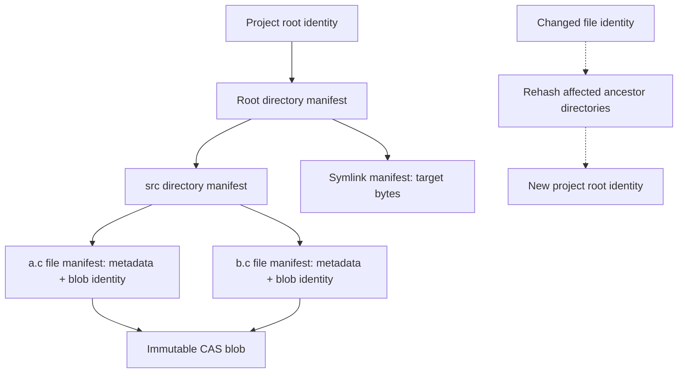

Filename ordering is unsigned bytewise, independent of locale. Unix names and
symlink targets need not be UTF-8. Use a deterministic lossless byte representation
in manifests; an encoding must never confuse distinct names. Reject duplicate
entries and invalid components such as slash, NUL, dot, and dot-dot.

Exclude host inode numbers, mount IDs, atime, and ctime from canonical identities.
They belong to the observation cache. The identity of an object covers its kind,
its content, its permission bits, and its ownership. A change of mode or a
`chown` thus gives a new root. The mtime is an attribute: the manifest stores it
so that a baseline materializes with it, but the identity does not include it.
A change of mtime alone, or a directory mtime that a change of membership
updates, gives no new root and no merge conflict. ACLs and other xattrs are not
preserved in version 2; capture rejects them rather than silently claiming a
faithful capture.

Content deduplication does not imply hard-link identity. A pair of independent
files with equal content must remain independent. Hard-link topology needs a
separate deterministic representation; host inode numbers only discover groups
within one capture. The topology is not part of the identity.

Capture counts the aliases of each host (device, inode) pair that it finds in
the project and compares the count with the link count:

- A file with one alias in the project has its other links outside the
  project, for example in a pnpm store or in the repository that a
  `git clone --local` linked. Capture records it as an ordinary file and loses
  nothing.
- A file with two or more aliases in the project loses its topology when the
  aliases are captured as independent files.

A configuration option selects the behavior for multiply linked files:
`reject` refuses the capture with an actionable diagnostic; `accept` captures
each alias as an independent file; an allow list of paths accepts the listed
paths and rejects the others. Host application replaces a file through a staged
file and `rename` (section 10). It never writes into an existing inode, which
can be shared with a store outside the project.

A child-object change changes the identities of its ancestor directories. Equal
root identities mean equal canonical state under the same schema and metadata
policy. They do not prove the current host still has that state.

Store project references in the open branch `store` through the existing store
build/merge/publication path. Named views live in `store/views` (section 11.2).
A proposed `project` member carries the managed project state and transaction
references of section 9.1. Concurrent different updates to this member
must use existing three-way conflict handling; do not create another root CAS
reconciliation loop. A turn must retain its own baseline/result references rather
than relying only on a branch's most recent project state. Exact transcript linkage
is an implementation design gate.

### 4.1 Identity encoding

A builder returns a caller-arena-owned generic manifest with `version: 2` and
`algorithm: blake3`. A file or symlink manifest has `kind`, mode, uid, gid,
`mtime_sec`, `mtime_nsec`, and its content: the blob digest and size, or the
target bytes. A directory manifest has the same metadata fields and sorted
`entries`. Each entry contains `name_hex`, child kind, and the child's BLAKE3
digest. A manifest has no host inode, ctime, or observation-cache fields. Hex
filename encoding preserves arbitrary non-NUL Unix name bytes.

The BLAKE3 input is independent of generic emission style and arena layout. Each
number is an unsigned eight-byte big-endian word. Each digest is its 32 raw
bytes. The mtime fields are not part of the input.

- A leaf starts with `fyai/project/leaf/blake3/v2` including its terminating
  NUL, then its kind string including its terminating NUL, mode, uid, gid, and
  the content. File content is the blob size and the blob digest. Symlink
  content is the target length and the raw target bytes.
- A directory starts with `fyai/project/directory/blake3/v2` including its
  terminating NUL, then mode, uid, gid, and the entry count. For each entry,
  append the name length, the raw name bytes, the kind, and the child digest.

Kind values are file=1, directory=2, and symlink=3. Changing this encoding
requires a new version and domain. Version 1 is not read. Names are sorted by
unsigned bytes with shorter prefixes first. Duplicate names and invalid
references fail.

The builder operates on already captured child identities. Recursive filesystem
capture, schema ingestion validation, durable publication, and view mounting are
separate implementation steps. Validation of child digest syntax does not prove
that the referenced object exists; publication must enforce closure of the tree.

## 5. CAS blob storage

The storage layout is:

```text
<project>/.fyai/
    objects/blake3/<digest>
    views/view-XXXXXX/
        baseline/    sealed metadata or copied lower
        data/        data-only lower of the metacopy backend
        upper/       writable upper
        work/        OverlayFS work directory
        cover/       empty directory for read-only cover mounts
        merged/      mount point for trusted ingestion
```

The arena directory is selected by the configuration and can be outside the
project. A view rejects an arena or storage directory inside the project other
than the reserved `.fyai`. The CAS, the baselines, and the uppers are on one
filesystem, which section 5.1 requires.

`view enter` clones the view directory into its mount namespace at
`/tmp/.fyai-view-runtime` before it mounts the overlay. The overlay then covers
the project path, and with it `<project>/.fyai`; the clone keeps the backing
directories reachable for the mount. After the mount, a read-only cover hides
the clone from tool code. A project at that path is rejected.

Resolve the storage domain against existing arena ownership and GC before adding
paths. No raw provider credentials enter blobs through configuration capture.
Exclude fyai storage and internal runtime paths from project ingestion. Do not
implicitly exclude user source files by Git ignore rules; ignored files may be
necessary for builds.

Publish a blob by writing a private temporary file, hashing exactly the captured
bytes, finishing durability as required, and installing it without replacing an
existing digest name. Verify an existing object before accepting reuse when its
integrity is uncertain. Digest collisions or inconsistent size/content are errors.
Do not trust a digest-shaped filename alone. Temporary files are not canonical
objects. Crash recovery may remove orphan temporaries.

No writable descriptor to a published blob may survive publication. Tools receive
no direct blob path, descriptor, or write grant. Filesystem permissions alone are
insufficient when agent and storage have the same host UID; the execution view
must hide backing paths and enforce access restrictions. Optional fs-verity can
strengthen immutability and integrity. Its digest is a separate field from an
ordinary content hash unless the schema deliberately uses the verity algorithm.

### 5.1 Shared inodes (proposed)

OverlayFS never writes to a lower inode; copy-up writes to the upper. Tools
cannot reach a backing path. A baseline inode thus has the same immutability as
a CAS blob, and the two share an inode:

1. Capture writes the bytes one time, into the baseline file, and hashes them.
   If the digest is new, it links that inode into `objects/blake3/<digest>`.
   The CAS ignores inode metadata. After publication, no writable descriptor to
   the inode remains and its metadata does not change.
2. A new baseline links the inode of the previous baseline for a path when the
   file manifest of that path is equal. The test compares the inode metadata
   (mode, mtime, and ownership), because the inode carries it, even when that
   metadata is not in the merge identity.
3. One baseline never gives one inode to two paths. Files with equal content
   and metadata are frequent. A shared inode would show them as hard links to
   `tar`, `rsync -H`, and `cp -a`. Reuse is thus keyed by path and file
   manifest, across baselines only.
4. A file that is not linked is cloned with `FICLONE`, else copied with
   `copy_file_range`, else with `sendfile`.

A file in a view reports a link count above one. No two paths of one view share
an inode. On a filesystem without extent sharing, the host project and one copy
are the stored bytes; a later baseline stores only the changed files. GC that
removes a CAS name or a baseline removes one link and does not affect the other.

### 5.2 Borrowed blobs (proposed)

A path that a policy declares immutable by contract can be captured by a hard
link to the host inode instead of a copy. The default list is
`.git/objects/**`: Git writes an object or a pack through a temporary file and
`rename`, deletes it on `gc`, and never writes into it. Its only change to an
existing file updates the mtime, which is not part of the identity. Capture
reads the file one time to calculate its digest and writes no bytes.

The link shares the inode, not a directory. The baseline directories remain
owned by fyai. A host rename, deletion, or `gc` removes only a host name; the
link keeps the inode. Only a write into the inode reaches the CAS.

The immutability of a borrowed blob thus depends on the host, not on fyai. A
write into the inode makes the content under the digest name incorrect for every
root that refers to it. The CAS therefore records that the blob is borrowed, and
verifies its digest before it trusts it: when a new baseline uses it, during
`--verify`, and before GC counts it as valid. A blob that fails is quarantined,
and the file is captured by copy. The link requires the CAS and the project on
one filesystem, and `fs.protected_hardlinks` permits it because the user owns
the file.

OverlayFS does not define the behavior when a lower layer changes while it is
mounted; it does not crash or deadlock. A file that has no copy-up reads the
lower inode, a cached directory listing can be stale, and a copy-up takes the
content of that time. The effects stay in that view, and the upper can be
discarded. The integrity of the records is the cost: exit capture reuses the
baseline identity of each path that has no upper entry and does not read it, so
a changed lower inode makes the result root state bytes that the agent did not
see. Only paths declared immutable can thus be borrowed. All other baseline
files are inodes that fyai owns.

### 5.3 Collection

Published objects are never edited in place. GC deletes only unreachable, unpinned
objects. Active views and incomplete recoverable application records pin their
roots before mounting. Cross-process GC needs durable or locked pin ownership and
a crash-recovery protocol; an in-memory reference count is insufficient.

## 6. Host capture and avoiding redundant work

Host capture occurs at initialization and at an explicit refresh (section 9.1).
Section 6.1 makes a refresh read only changed files. Section 6.2 is an optional
later optimization of a refresh; the managed-root model does not require it.

### 6.1 Observation cache

Cache host bindings separately from canonical state: filesystem identity, inode,
type, size, mtime and ctime at available precision, mode, uid/gid, link count, the
previous object identity, capture epoch, and timestamp-race status. Cache keys
include project identity and filesystem context; inode reuse and remounts must not
silently reuse unrelated observations.

A matching fingerprint can avoid reading file bytes under a documented local
filesystem cache assumption. It is not a proof. Adopt Git's racy-stat principle:
entries captured in an ambiguous timestamp interval require a content check,
and ambiguity remains recorded across later cache publications. Clock changes,
coarse timestamps, unavailable fields, and unsupported filesystem behavior force
conservative checking.

Directory mtime can help cache immediate entry enumeration. It cannot certify
unchanged descendant contents. After an unobserved interval, inspect cached child
objects even when the directory fingerprint is unchanged. Merkle hashes avoid
rebuilding unchanged canonical paths; they do not detect external writes.

### 6.2 Monitor lifecycle (optional)

Start monitoring before the initial scan. Record an epoch and collect events while
capture runs. Reconcile dirty paths and directory memberships before declaring the
baseline ready. Continued activity may require retry; bound retries and report
which objects prevented capture.

Prefer fanotify where capabilities and filesystem support permit it. Directory
marks are not recursive. Unprivileged operation needs per-directory marks and a
scan when a new directory is admitted. Filesystem-wide marks require appropriate
privileges and filtering to the project's identities; they can observe access
through other mounts. A bind mount of the project alone does not ensure events
from host aliases are observed. Mount marks also have event-mask limitations.

Track modification, metadata, creation, deletion, and rename invalidations using
the supported reporting mode. Dirty file identity invalidates every cached hard-link
alias. Rename invalidates old and new parent membership. Mark ancestors dirty for
Merkle rebuilding. A write event invalidates immediately; waiting only for close
misses files that stay open. Events are hints to reconcile current state, not an
ordered replay log.

Overflow, coverage loss, unsupported reports, mount changes, and monitor failure
invalidate the relevant cache scope. Fanotify does not cover writable mmap changes
or remote changes on network filesystems. Monitoring alone must not enable a
strong unchanged-content claim. Metadata reconciliation or strict content checking
remains necessary under those conditions.

Between invocations there is no watcher. Startup performs metadata reconciliation,
usually reusing cached content digests. It cannot skip a complete subtree solely
because its directory timestamp matches. Durable cache data lives in arenas;
watch descriptors and dirty queues do not survive the process.

The cache selects work; accepted canonical objects define the baseline. A lost
monitor epoch requires reconciliation even if the previous Merkle root is known.

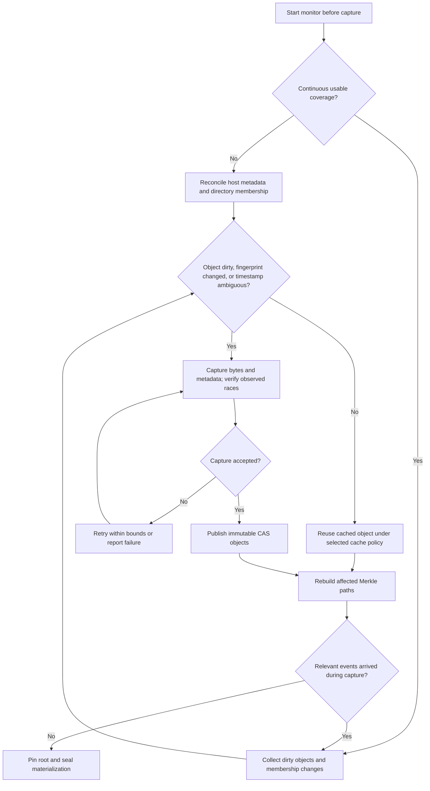

This flow does not turn notification silence or matching timestamps into a proof
of unchanged content. Section 6.3 defines the capture limits.

### 6.3 Capture acceptance

Use directory-relative, anchored resolution and do not follow symlinks during tree
capture. For files, open the source, observe descriptor metadata, copy/hash to a
private temporary, then observe again. Retry on detected changes or replacement
and reconcile its parent. Check directory membership around enumeration and
against dirty events. Bound sizes, depth, object counts, and retry work.

This detects many races but does not prove coherent bytes against arbitrary
concurrent writers. A strict guarantee requires a filesystem snapshot or effective
cooperation excluding writes during capture. Permission notifications do not stop
writes through previously opened descriptors. State the selected capture policy in
the transaction; never describe an ordinary walk as a whole-tree instant snapshot.

## 7. Sealed baseline and OverlayFS

Materialize each root as an ordinary directory tree. Regular file metadata entries
refer to immutable CAS objects through OverlayFS metacopy/data redirects. CAS is
mounted as a data-only lower layer; blob names do not appear in project enumeration.
Directories and symlinks are represented directly. Complete and validate all
metadata and redirects before mounting. No Composefs image is generated.

The following is a conceptual layout, not a fixed mount option string:

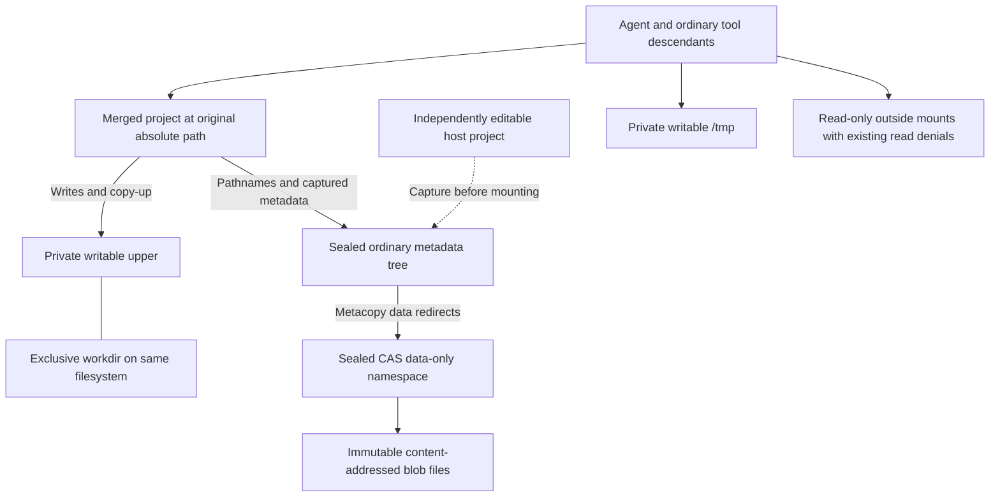

Solid arrows show execution access or backing references. The dashed capture edge
is a setup operation; the mounted view never reads live project bytes from the host.

Mainline OverlayFS sets `metacopy=off` and `redirect_dir=nofollow` when
`userxattr` is given, and a data-only lower layer requires metacopy. A rootless
view therefore uses the copy backend of section 11.2. The copy backend is the
normal rootless path; the metacopy backend applies to privileged mounts, or to a
kernel that the probe accepts.

With `redirect_dir` off, `rename(2)` of a directory that is in the lower layer
returns `EXDEV`. This is a known limitation of the copy backend. Most programs,
`mv` included, then copy and delete.

Probe the actual kernel, filesystem, namespace privileges, xattr support, and
mount configuration. Do not infer support from kernel release alone. Data-only
redirection, user versus trusted xattrs, writable copy-up, and Landlock integration
must pass the validation matrix before this path is offered.

All metadata references must resolve only within the selected CAS data layer.
Strip source OverlayFS control xattrs during capture. Agents must not forge
metacopy, redirect, opaque, or whiteout control state through user xattrs. A
`userxattr` mount requires an explicit enforcement solution or rejection; Landlock
alone does not provide arbitrary xattr filtering.

The upper and workdir are exclusive to one view, reside on a compatible filesystem,
and are never shared by active mounts. Sealed baseline trees may be reused for an
identical root and policy. Do not modify a mounted baseline, existing referenced
blob, or backing upper through direct host operations. Additions to a shared blob
store while any view is mounted require validation against OverlayFS backing-layer
rules; the initial implementation can use a sealed per-view data-layer namespace
referencing only its root's blobs. Later objects are published outside that sealed
namespace. This avoids assuming a mutable data-directory listing is supported.

Native OverlayFS interprets upper state. Opening for write may create copy-up even
without a semantic change. Upper presence is therefore not sufficient to report a
file modification. Directory redirects, metadata-only upper entries, whiteouts,
and opaque directories require correct final-view interpretation.

## 8. Execution containment

Create a private mount namespace, prevent propagation to the host, and establish
read-only outside mounts recursively, including submounts. Cover the original
absolute project path with the merged overlay. Ensure original project aliases,
backing paths, inherited cwd, directory descriptors, proc descriptor paths, and
other process root links cannot bypass the view. Namespace setup is not a complete
same-user process-isolation boundary; retained process access needs explicit review.

Give each transaction a private `/tmp`. Do not inherit broad writable `/var/tmp`,
`/dev`, `/run`, or `/dev/shm` grants. Programs needing scratch outside `/tmp` use an
explicit private mount or fail with a clear policy error. Provide only necessary
device endpoints, such as null and the session PTY. Device operations are exceptions
to regular-file read-only policy and must be enumerated.

### 8.1 Role-specific CAS project projections

The view constructor combines a canonical project root with a supervisor-authorized
execution role. Visibility of runtime storage is not a property of project content.
The CAS capture/materialization layer reserves `.fyai` at the protected project
location and excludes its host contents from manifests. It rejects attempts to
publish project content at that reserved path. An upper entry named `.fyai` must
never be interpreted as an arena or replace the protected mount on reconstruction.
The same exclusion applies to actual arena and CAS storage paths outside that
location; covering a project-local alias alone does not hide `~/.fyai`.

| Projection | Project access | Protected `.fyai` location |
| --- | --- | --- |
| Agent runtime | Its transaction overlay | Direct shared arena mount |
| Ordinary tool | Its owning agent's transaction overlay | Empty read-only cover mount |
| Delegated agent runtime | Separate parent-derived transaction overlay | Supervisor-provided direct shared arena mount |

The cover is a mount supplied by the view constructor, not a whiteout committed
into CAS. It cannot be removed by ordinary project writes. The shared arena is
never captured, overlay-copied, or relocated; existing arena mappings must retain
their required addresses. Canonical project manifests cannot grant arena access.
Preserve existing credential/read denials and hide all backing-storage aliases.
`--root` remains read-only; reject writable project transactions and host application
rather than turning them into transient writes implicitly.

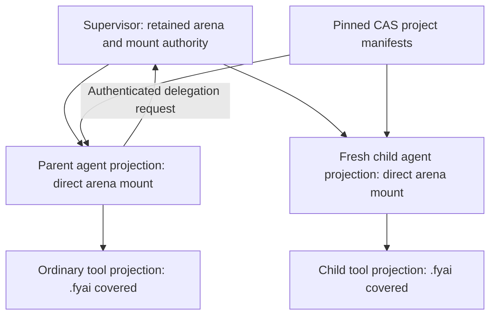

Sub-agent creation does not uncover `.fyai` in a tool namespace. The admitted
parent requests delegation through its authenticated control channel. A supervisor
context retaining arena authority builds a fresh child agent projection, supplies
the arena directly, establishes transport admission and containment, and only then
releases the child. Executing `fyai` from an ordinary shell tool grants no agent
role or arena access. Role authorization is not inferred from executable name,
arguments, environment, or project files.

Landlock restrictions are inherited and cannot be relaxed. Therefore, launch an
admitted child agent from the trusted context that retained the necessary authority,
not from an arena-denied tool context. This is a required extension to the current
direct child-launch path: the invocation supervisor must provide an authenticated
launch service, or an equivalent trusted launch context, without becoming a daemon.
The implementation must reconcile supervisor-launched process ancestry with the
transport's delegation registry and retirement ownership. Landlock complements
these projections; it does not implement reveal-on-delegation.

Covering a pathname does not revoke inherited open descriptors or memory mappings.
Before releasing ordinary tool code, close arena and backing-directory descriptors,
discard inherited arena mappings through an exec boundary or a validated equivalent,
and eliminate proc/root/descriptor aliases into an agent's privileged view. A
forked tool must not retain an agent arena mapping. If an existing adapter cannot
provide this separation, fail its protected launch rather than claim the cover
mount alone confines it.

### 8.2 Policy application and tool adapters

Apply Landlock after mounts are finalized, close unwanted inherited descriptors,
drop mount/setup privileges, and set no-new-privileges before executing tools.
Verify the policy handles truncation and other required rights. Read-only mounts
supply metadata restrictions Landlock alone cannot guarantee. Preserve independent
network policy and existing transport sender authentication.

The covers and the read-only mounts are made in the user namespace in which tool
code runs, so the kernel does not lock them (`MNT_LOCKED`). Two layers prevent
their removal. Landlock in strict mode denies every change of the mount
topology, and fails closed when Landlock is not available. The capability drop
removes all capabilities and the bounding set and sets `SECBIT_NOROOT_LOCKED`. A
tool that makes its own user and mount namespace receives locked copies of the
mounts. Every tool adapter applies both layers; an adapter that cannot apply
them fails its launch.

Every tool adapter acquires the execution view explicitly. MCP services outside
this process tree do not become isolated by attaching the local shell to a mount
namespace; expose or deny their host writes separately. User-owned session shell
commands remain host operations and are distinguished from model-owned tools.

## 9. Turn and agent lifecycle

Section 9.1 is the normative lifecycle. A transaction captures the host only at
import or explicit refresh; a turn or an agent starts from a recorded root.

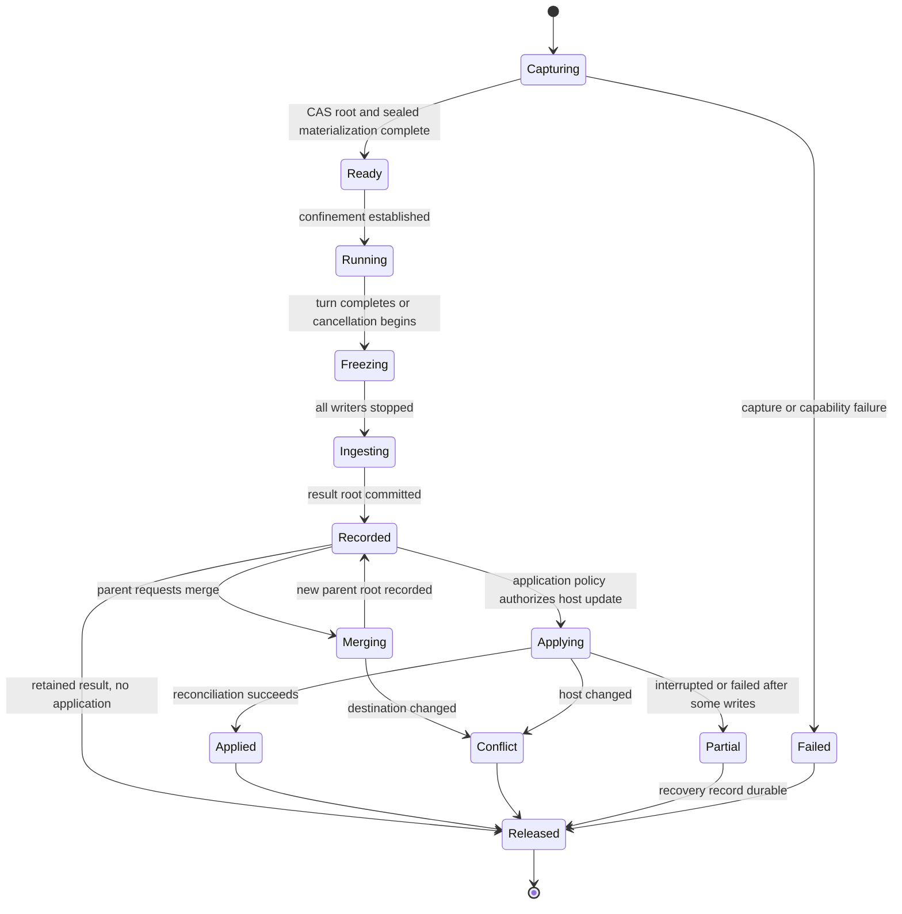

A transaction is shared by an agent and its ordinary tool descendants. Each
delegated agent execution instead receives a private upper rooted in a sealed
checkpoint of the parent view. The parent inspects and merges that result
explicitly, or enables tool-boundary propagation. Capturing a running parent view requires pausing its writers or another
validated snapshot mechanism. Do not share writable uppers between independent
views or silently substitute a fresh host baseline for the parent state.

Delegation pins a parent-derived baseline. The child result remains separate until
explicit reconciliation or configured propagation accepts it; a merge replaces
the parent view at a safe boundary.

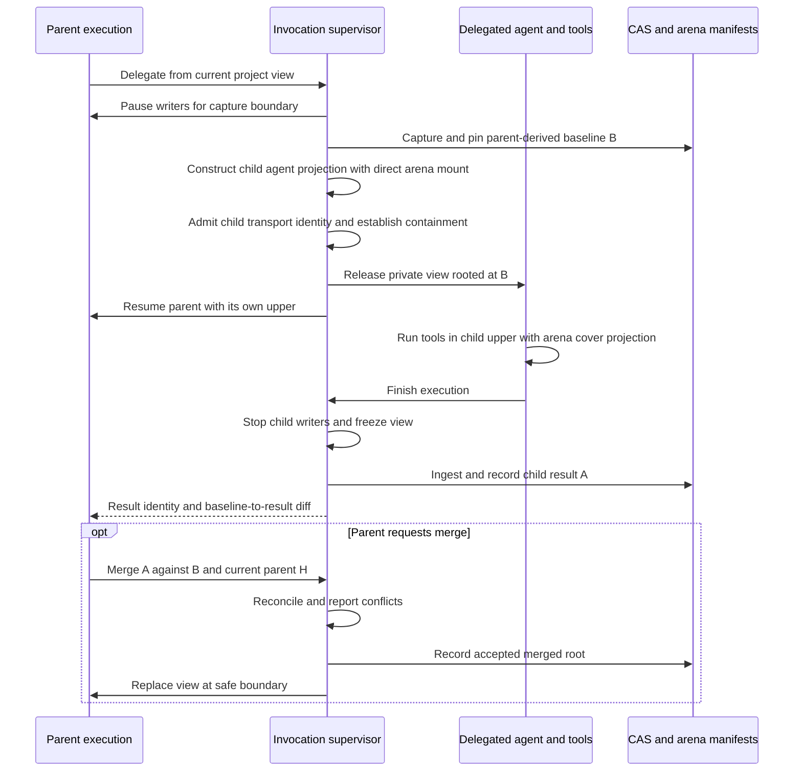

A conflicted merge does not install an unresolved root. The parent can inspect the
recorded child result without changing its own view.

An open writable descriptor or a shared writable mapping keeps authority over an
upper. A PID namespace for each workspace owns the lifecycle of its processes:
no descendant can leave it, and the exit of its init ends all of them. Each
workspace also has a cgroup of its own, below the cgroup of the invocation.
Every process of the view joins it before it runs tool code. A checkpoint writes
`cgroup.freeze` and waits until `cgroup.events` reports `frozen 1`. The freeze
includes processes forked during it. It sends no signal and does not change job
control, so a retained shell does not see it. The capture reads through the
merged mount, which also shows page-cache data and writable mappings. The
checkpoint then thaws the cgroup.

All agent processes end when the turn ends. The freeze holds a straggler that
did not end, such as a background descendant. When a writable cgroup is not
available, a checkpoint is permitted only when no process other than the
namespace init is alive. Otherwise the checkpoint is refused, and the
diagnostic names the processes and states that no cgroup is available.
`cgroup.kill` can end the processes of a workspace when its cgroup exists; the
PID namespace remains because it also gives the private `/proc`.

A checkpoint or a turn boundary does not replace the lower (section 11.3.8), so a
frozen writer resumes on the same upper. Only a baseline change ends the
terminal sessions that hold the view.

For interactive multi-turn sessions, the next baseline normally continues from
the recorded result without importing intervening host changes. Importing host or
parent changes is an explicit reconciliation operation, or a configured policy.
Never refresh a live lower in place. Resolve conflicts before releasing a view
that depends on that reconciliation. Long-running programs cannot transparently
retain descriptors across view replacement in the first version.

Cancellation stops writers before unmount and pin release. A result may be retained
as cancelled work only after successful ingestion. Report incomplete capture or
lost uncommitted writes explicitly. Namespace destruction handles mount teardown;
it does not replace cleanup of backing directories and pins.

### 9.1 Managed branch roots and tool checkpoints

Managed project roots are the ordinary source of successive turn and agent views.
The host tree is imported at initialization or explicit refresh. A new turn mounts
its branch’s recorded project root; spawning an agent uses a pinned parent
checkpoint. Neither operation rescans the live host project. The existing
`view update NAME` command retains its fresh-host replacement semantics; updating
a managed view from a recorded root is a distinct internal operation or explicit
future source option.

At a completed turn, publish the conversation and its project baseline/result
references through the same branch publication. Each tool checkpoint records its
project root and provenance without inventing a completed conversation turn.
Subsequent turn commitment links the checkpoint state to the actual turn. A lost
branch CAS reconciles through the existing branch publication machinery.

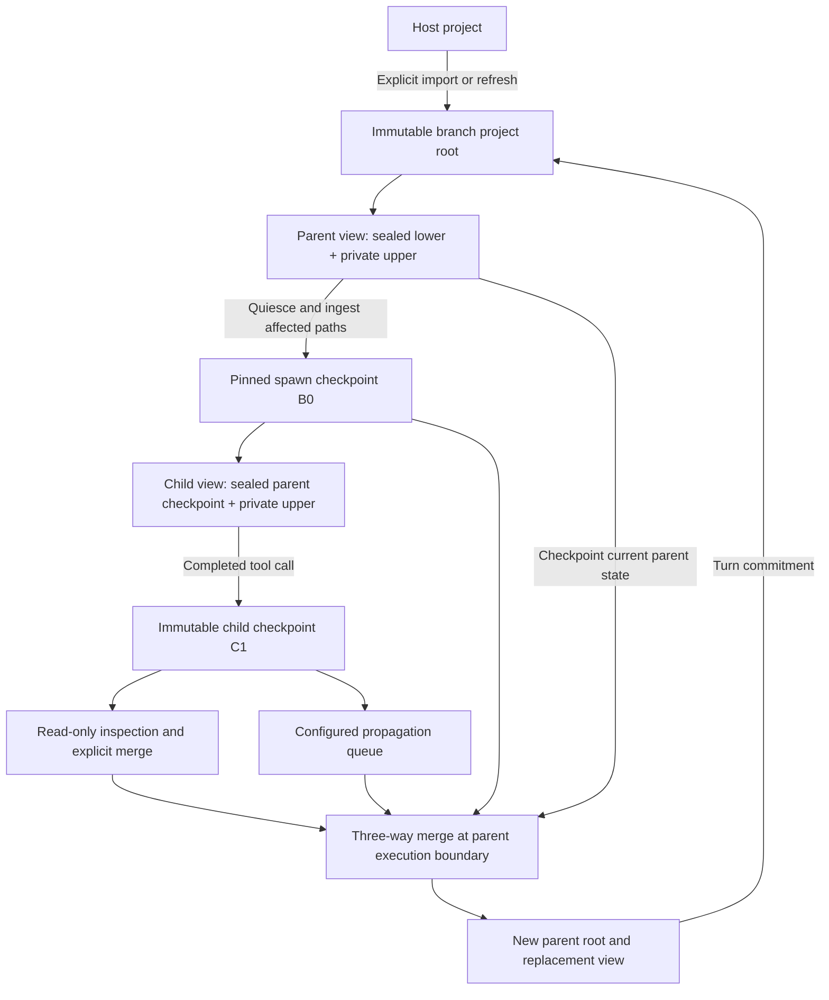

The upper bounds the changed-path candidates inside an owned view. Whiteouts,
opaque directories, replacements, and metadata are interpreted through the merged
view. Copy-up alone is not evidence of changed canonical content. Hash changed
objects and rebuild affected Merkle ancestors; reuse immutable lower objects.
No notification stream or timestamp heuristic is needed to establish which managed
subtrees can be reused. This assumes exclusive supervisor ownership of backing
layers and a validated writer-quiescence boundary.

A stacked child view must use an immutable parent checkpoint, never the parent’s
live writable mount. If a frozen materialized parent projection serves as an
OverlayFS lower, pin it until all dependent children and inspection mounts release
it. Each independent view owns distinct upper and work directories. Lower layers
may be shared; changing backing layers underneath a live overlay is unsupported.
See the [kernel OverlayFS documentation](https://docs.kernel.org/filesystems/overlayfs.html).
Layer freezing/rotation occurs only after all writers and retained writable file
references have been retired. Layer compaction is a quiescent reconstruction from
CAS, not an in-place edit of a live lower.

There are two child publication policies:

| Policy | Publication and visibility |
| --- | --- |
| Separate | Record child roots for read-only inspection and explicit parent pull/merge |
| Propagate | After each completed child tool call, ingest and publish its checkpoint, then queue reconciliation into the parent |

Propagation is immediate at tool boundaries, not at individual writes. Before
checkpoint ingestion, retire every writer owned by that tool call, including
background descendants. Persistent shells and writable mappings must participate
in the barrier or prevent publication. If the parent has a tool in flight, defer
installation until its next quiescent boundary. Reads from the next admitted
parent tool see the accepted root. An already-running parent tool retains its
original view. No parent backing tree is modified while mounted.

The first propagation merge uses the spawn root B0 as its base, the child
checkpoint C1 as its incoming state, and the current checkpointed parent root P
as its destination. After successful acceptance of C1, record C1 as the base for
the next child publication C2. Comparing every child checkpoint to B0 would
reapply earlier edits and create false conflicts with already accepted changes.
The accepted checkpoint reference is durable and separate for each child.

```mermaid
sequenceDiagram
    participant C as Child tools
    participant S as Supervisor
    participant A as CAS and branch arena
    participant P as Parent tools
    C->>S: Tool call completes
    S->>S: Retire child tool writers
    S->>A: Ingest delta and publish child checkpoint C1
    S->>S: Queue C1 with last accepted child base B0
    P->>S: Reach quiescent tool boundary
    S->>A: Checkpoint current parent root P
    S->>S: Merge B0, C1, P
    alt Conflict-free acceptance
        S->>A: Publish parent root and accepted child base C1
        S->>P: Admit next tool in replacement parent view
    else Conflict
        S->>A: Retain C1 and pending propagation record
        S->>P: Report conflict; preserve parent view and accepted base B0
    end
```

Automatic propagation accepts a checkpoint as one transaction. Conflicts preserve
the parent root and leave the child checkpoint available for explicit resolution;
they do not silently choose a winner or install a partially merged root. Duplicate
checkpoint delivery is idempotent. Accepted parent roots and child merge bases
publish together so crash recovery cannot replay an already accepted delta.
These records live in branch-store generics and retain the relevant CAS roots.
Propagation requires no daemon: the active invocation supervisor owns execution,
publication, and installation; durable pending checkpoints survive its exit.

## 10. Result ingestion, parent merge, and host application

Once frozen, inspect the merged result to construct canonical changed objects.
Use upper entries to bound candidate work, but resolve their meaning through the
merged view rather than treating the upper as a ordinary patch directory. Expand
redirected or opaque directory candidates as necessary. Strip internal OverlayFS
metadata and compare canonical identities to eliminate copy-up-only changes.
Publish blobs and tree objects before recording the result root.

A parent can inspect the baseline-to-result diff without changing any filesystem.
A merge into a parent view produces a new immutable root and a replacement view at
a safe execution boundary; it does not mutate that parent's mounted backing tree.
Automatic host application is opt-in configuration. The default records the result
and leaves it separate until the parent requests a merge or application.

Let B be the baseline, A the agent result, and H the current destination state
(a parent project root or freshly observed host state).
For each affected path and necessary directory/topology dependency:

| Relationship | Action |
| --- | --- |
| A equals B | Preserve H |
| H equals B | Propose A |
| A equals H | Already satisfied |
| Both changed differently | Report a conflict |

The same identity rules apply to a parent root and a freshly captured host destination.
They select proposed changes; host writes still need the application protocol below.

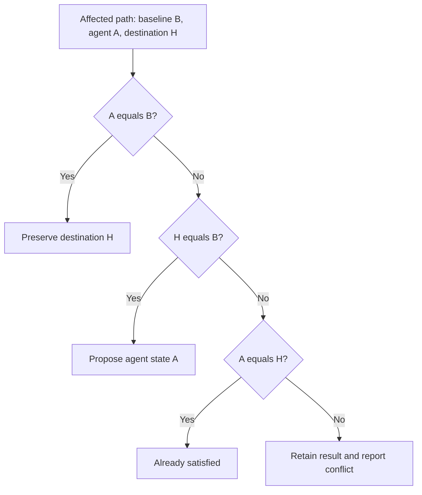

Directory membership is merged by name, not by treating any directory hash change
as a blanket conflict. Include ancestor type changes, symlink replacement,
hard-link effects, deletions versus new children, mode, and ownership in
reconciliation. The mtime is not compared and does not conflict: a path taken
from A keeps the attributes of A, and a path kept from H keeps the attributes
of H. Host application gives a written file the current time, not the mtime of
A, because the host can have built outputs after the agent wrote the file. Do
not overwrite unrelated host edits. Text merging, if later added, is explicit
policy; object identity comparison does not itself merge file contents.

### 10.1 Renames

The merge detects renames from identities, as Git does. Detection runs on each
side against B, over the delta of that side only, so its cost follows the size
of the delta and not of the tree. All pairing uses unsigned bytewise path order,
so every process gets the same result.

1. Exact subtree move: a directory identity that is removed at one path and
   added at another path is a move of the complete subtree.
2. Exact file rename: removed and added files are indexed by content, the blob
   digest or the symlink target. A unique match is a rename. When several
   paths have the same content, a pair with the same basename is preferred;
   else the first path in order. A change of mode or ownership is a
   modification at the new path. An empty file is not a rename source.
3. Directory rename: a directory that no longer exists on a side is renamed to
   the directory that received the most of its renamed files. A tie between
   two targets is a split, and no directory rename is inferred. Inside an
   inferred directory rename, a removed `d/x` pairs with an added `e/x` whatever
   its content.

Renames with changed content outside an inferred directory rename (Git's
similarity detection) are not detected in the first version.

Each side gives a map from a path of B to its path on that side. The merge then
decides the content and the location of each object of B separately:

| Case | Result |
| --- | --- |
| Content | The table of section 10, which compares A at its path with H at its path |
| One side moved the object | Take the move |
| Both sides moved it to the same path | Already satisfied |
| Both sides moved it to different paths | Rename/rename conflict |
| One side renamed it, the other side deleted it | Rename/delete conflict |
| One side renamed and modified it, the other side modified it | Content conflict |
| One side added a path under `d`, the other side renamed `d` to `e` | Move the addition to `e/` and report it as a conflict for review |
| Two objects are put at one path | Conflict that names every source |

A file renamed on one side and edited on the other side needs no text merge:
the result is the content of the editor at the path of the renamer. A path that
a directory rename moves is reported as a conflict for review, which is the Git
default (`merge.directoryRenames=conflict`). The merge result records the pairs
that the merge inferred. `view diff` reports a move as a move. The host
application plan has a move step: it uses `renameat` when the host source still
has the expected identity, and otherwise writes the new path and removes the old
path. Crash recovery handles a move as any other step.

Host application is not atomic across a project. Use anchored parent descriptors,
private staged replacement files, verification immediately before mutation, and
atomic rename where applicable. A check followed by rename still has a race against
an uncooperative writer; ordinary Unix operations do not provide a content-based
compare-and-swap for a pathname. Cooperative locking or a filesystem-specific
transaction is required for a stronger guarantee. Never claim that staging alone
prevents all lost updates.

Before writes, record a durable application plan with baseline, target, expected
host identities, and progress/recovery information. Crash recovery reconciles actual
host state against that plan; do not blindly roll back over new user edits. Report
applied, conflicted, untouched, and uncertain paths. CAS success and host-application
success are separate outcomes.

The `.git` directory is not merged or applied per path; section 11.3.2 gives the
transfer of commits. Trust in content taken from a view is a property of the
host-application policy as a whole. A file such as a `Makefile` or an `.envrc`
has the same trust question as Git configuration.

Configuration selects explicit parent merge, explicit host application, or
automatic host application. A request originating in an untrusted tool cannot
change that policy or authorize its own host application. Retain the recorded
result when conflicts or application failures occur.

## 11. Persistence, recovery, and GC

Commit transaction roots through existing branch publication and retain provenance
linking the invocation/turn to its baseline and result. Branch-store merge preserves
unknown state and reports conflicting project paths or project reference updates.
Do not introduce sidecar canonical configuration or root-level project state.

Before GC removes a blob, check reachability from retained branch and turn project
roots, active transaction pins, and pending recovery plans. Coordinate publication,
pin installation, and collection across independent invocations. GC must not relocate
live arenas. A crash may leave unreachable objects or materializations; it must not
leave a published root whose blobs were never durable.

Observation caches and materializations are rebuildable. Losing them affects startup
cost, not canonical project state. Upper/work/scratch are ephemeral until ingested;
never present their survival after a crash as a durable result.

### 11.1 User-facing view lifecycle

Add a `view` command group through `data/commands.yaml`, the shared registry,
argument schema, completion, and result presentation. The same definitions supply
CLI verbs and applicable session slash commands. The following operations define
the intended interface; names and arguments are not implemented by this document.

| Operation | Behavior |
| --- | --- |
| Create | Capture a project and record a separate named view with its pinned root |
| Inspect | Show roots, metadata, mount state, and proposed changes without application |
| Mount | Mount at an explicit host path until an explicit unmount, or use invocation-scoped mode |
| Unmount | Verify mount ownership, stop/refuse active writers, ingest writable state, and release mount pins |
| Enter | Construct an invocation-scoped private mount and launch a shell or command with cwd inside it |
| Merge/apply | Reconcile a recorded view into its parent or the host under configured policy |

Support both explicit persistent mounts and invocation-scoped mounts. A persistent
mount is an intentional user-visible resource at a supplied path, not a hidden
resident process. Record its identity, source root, backing resource ownership,
permissions, and pin in arena state. Later invocations verify the actual mount
against that record before acting; stale records do not authorize unmounting an
unrelated filesystem. Where required privileges are unavailable, fail that mode
and report the requirement rather than starting a background helper.

Invocation-scoped mounts exist only for `view enter` or the execution that owns
them. Tear them down after writers exit and result ingestion completes. An enter
verb cannot change its invoking shell's working directory; it starts a child shell
or executes the requested command within the view. A session operation can select
a view for future tool launches only after its active writers reach a safe boundary.

Persistent writable mounts require explicit freeze/unmount before a result root
can be declared final. Active mount pins survive the creating invocation and GC
must verify mount/resource liveness before releasing them. Persistent-mode recovery
must handle reboot, remounts, stale mount IDs, and mountpoint replacement. Do not
claim that a CAS result reflects writes that have not yet been ingested.

Creation and entry use the ordinary inspection/tool projection by default. They
cannot authorize a caller to reveal the arena. Only authenticated agent admission
supplies the agent-runtime projection described in section 8.1.

### 11.2 Initial executable command scope

The first implementation provides CLI-only `view create NAME [PROJECT]`,
`view update NAME`, `view show NAME`, `view list`, and
`view enter NAME [COMMAND [ARG...]]`.
Omitting PROJECT captures the current directory. Named view references live in
`store/views` on the selected branch; blobs live in `<project>/.fyai/objects/blake3`
and overlay backing lives in `<project>/.fyai/views/view-XXXXXX/`.
The same arena and branch must be selected on subsequent invocations.

```sh
fyai view create experiment .
fyai view enter experiment
fyai view enter experiment git status --short
fyai view enter experiment sh -c 'printf "hello\n" > example.txt'
fyai view enter experiment cat example.txt | tee captured.txt
fyai view update experiment
fyai view show experiment
fyai view list
```

Creation scans the project, publishes immutable blobs and Merkle manifests, and
materializes a separate baseline. Creation probes the metacopy backend: it tests
redirected reads and isolated write copy-up. Rootless mounts fail this probe
(section 7), and creation then uses `materialization: copy`, the normal rootless
backend. It preserves project metadata on ordinary files copied from CAS with
`copy_file_range` and its `sendfile` fallback. Section 5.1 proposes `FICLONE`
and shared inodes for this backend. The `materialization: metacopy` backend
builds a baseline of sparse metadata-only files and no image. The selected
backend is stored with the view and used consistently for entry, inspection
mounts, and exit capture.

With the metacopy backend, each baseline inode preserves project mode, ownership, size, and mtime. Its
`user.overlay.metacopy` marker and `user.overlay.redirect` path select a CAS blob
from the private snapshot `data` directory. This data-only directory hard-links
only blobs reachable from that snapshot, including one entry per content hash.
Metadata inodes remain distinct even when content is identical. CAS permissions
and timestamps are never changed. The data-only namespace is not a second
project-history layer; one project metadata lower and one writable upper remain.
No metadata cache or image construction is needed.

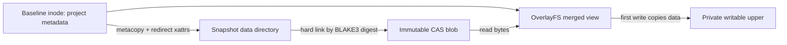
File hashing maps the private captured file, not the mutable host source. This
keeps host truncation from causing a mapped-source fault while retaining the
optimized BLAKE3 implementation.

Capture uses Linux `copy_file_range` for source-to-CAS copies,
with `sendfile` fallback when range copying is unsupported. One affinity-sized
libfyaml `fy_thread` pool runs file jobs and BLAKE3 chunk jobs. Each capture worker
reuses a hasher bound to that same pool. Workers never modify the generic builder;
the caller constructs directory manifests after all jobs join. Directory metadata
is applied after descendants are materialized. Source lookup rejects symlink and
mount traversal with `openat2`.

The temporary `--verify` option enables an independent serial stage before root
publication. A separate reused hasher has threading disabled. It checks CAS sizes
and digests, compares source bytes against the immutable mapped CAS capture, and
checks baseline metadata and redirect xattrs, and independently verifies snapshot data blobs. Source metadata is checked around
verification. Normal capture does not run this stage. The option applies to create,
update, and entered-result ingestion; place it before NAME for entry so command
arguments remain unchanged:

```sh
fyai view create --verify experiment .
fyai view update --verify experiment
fyai view enter --verify experiment make -j8
```

Exit capture uses the immutable baseline manifest and the frozen upper tree.
A merged child with no upper entry reuses its baseline object and subtree without
reading file contents or scanning the subtree. Only directories represented in
the upper are enumerated through the merged mount; OverlayFS resolves whiteouts
and opaque directories there. Changed files are ingested with the shared pool,
and affected directory manifests are rebuilt. Unreachable baseline objects are
excluded from the result manifest. Data-only mounts resolve unchanged baseline
bytes from CAS. Upper files contain their own complete data after write copy-up;
ordinary metadata-only upper metacopy is not enabled, and directory redirects
are not followed.
The cumulative upper is compared against the original baseline on every exit.

For `view enter --verify NAME ...`, capture also runs the full slow generation
with serial byte verification and compares the complete manifests before
publication. A mismatch fails ingestion and retains the previous published root.
Normal entry does not perform that full capture.

Entry creates private user, mount, and PID namespaces, mounts the overlay at the
original absolute project path, changes the child working directory there, and
executes the remaining argument list directly, or starts `$SHELL` (falling back
to `/bin/sh`) when no command is supplied. The caller’s UID and GID are preserved
inside the user namespace. Standard input, output, and error are inherited; pipes
and redirects belong to the invoking shell. Host mounts are recursively read-only.
`/tmp` is a fresh writable tmpfs. The reserved root `.fyai` is omitted from CAS and covered by an
empty read-only mount. Backing mounts and storage are inaccessible to tool code;
Landlock and dropped namespace capabilities enforce the execution policy.
The command cannot change its invoking shell's directory.

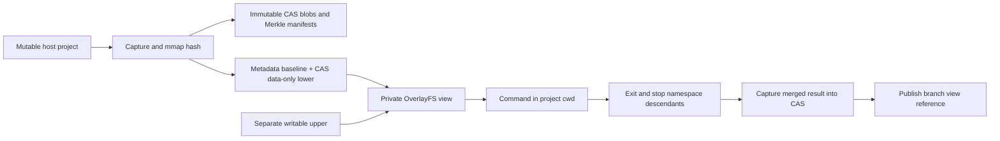

The view retains its upper between entries. An exclusive runtime lock prevents
concurrent writers; entry records `state: running`, and successful result
publication records `state: ready`. An observed execution or ingestion failure
records `state: incomplete`; a process crash may leave the running marker.
The previous published result remains available until a new result is captured.
The PID namespace supervisor waits for the executed child, then stops descendants
before a trusted helper mounts and ingests the merged state. Tool code does not
run as PID 1, so ordinary command signal handling remains available. Terminal
entry transfers foreground ownership and restores terminal settings on exit.
The CLI returns the child’s exit status after publishing its result and emits no
result document on the command’s standard output. Setup or capture failure fails
the verb. Inspect the resulting root separately with `view show`.

`view update NAME` captures the host project into a new baseline and an empty
upper, replacing the named view and discarding its changes. It requires the old
view’s exclusive lock. Failed capture leaves the old reference intact. Old backing
directories remain unreachable caches pending garbage collection; previous CAS
objects remain immutable.

Host changes after creation do not change the baseline. View changes are retained
separately and are never applied to the host by these commands. Automatic
tool/agent view selection,
parent merge/apply, incremental monitoring, cache reconstruction, and CAS garbage
collection remain later implementation steps. This initial capture rejects
hard-linked files, special files, and unsupported metadata rather than losing
them. Section 4 specifies the proposed option for hard-linked files.

### 11.3 Session filesystem policy and retained workspace caches

This section specifies the intended coding-session behavior. It extends the
managed root and checkpoint model in section 9.1; it does not claim that all
policy options or mount reuse described here are implemented by the current
`view` commands.

A session owns two related states with different lifetimes:

- The canonical project snapshot contains policy-included project objects and
  is identified by its Merkle BLAKE3 root. It is published with the appropriate
  branch, turn, or tool checkpoint.
- The retained workspace contains a sealed baseline, its writable upper, its
  work directory, and optional private scratch and cache directories. It can
  contain additional files that are intentionally absent from canonical state.

A project checkpoint is not a request to discard or reconstruct the workspace.
The same workspace can serve repeated tool calls and context entries, retaining
compiler outputs and other generated data without publishing those bytes to CAS.

#### 11.3.1 Filesystem classes and default visibility

| Class | Tool-visible state | Canonical capture | Lifetime and ownership |
| --- | --- | --- | --- |
| Project source | Writable merged overlay over a frozen baseline | Included according to project policy | Session workspace; roots retained by branches and turns |
| Ignored build outputs | Absent initially when excluded; writable when generated | Excluded according to project policy | Retained upper, subject to workspace retention policy |
| Temporary directories | Initially empty private writable mounts | Excluded | Execution or session scope, chosen explicitly |
| Secret files and directories | Inaccessible to tools | Never ingested | Host-owned; trusted harness access is separately authorized |
| Selected application caches | Explicit private or shared writable mounts | Excluded from the project root | Per-session cache or explicitly shared host cache |
| Project `.fyai` | Hidden from ordinary tools; available to authorized harness code | Reserved and excluded from project objects | Harness-owned arena, CAS, and workspace resources |
| Other host paths | Read-only where reads are authorized | Excluded | Host-owned and outside project snapshot identity |
| Devices, process filesystems, and sockets | Explicitly constrained endpoints | Excluded | Execution namespace and containment policy |

The default capture policy keeps project contents, apart from reserved harness
storage and secret exclusions. Git-aware filtering is an explicit policy choice,
not an implicit property of every project directory. Paths needed by the runtime
remain available through the external read policy; they are not copied into the
project simply because a compiler or shell reads them.

#### 11.3.2 Git-aware project inclusion

For a conventional Git project, a useful capture mode includes tracked files and
untracked files that Git does not ignore. Preserve `.gitignore` files themselves.
Ignore matching applies to untracked paths: a tracked file remains included even
when its name matches an ignore pattern. Evaluate Git ignore semantics, including
nested rules and negation, through Git-compatible behavior rather than a separate
incomplete glob implementation.

Ignored paths are candidates for exclusion, not proof that their contents are
rebuildable. An ignored dependency directory or local build configuration may be
required for execution. Policy must support explicit inclusions. Explicit secret
exclusion takes precedence over an inclusion or Git tracking status; a tracked
credential must not become accessible merely because it is tracked.

Apply the inclusion policy at both initial host capture and subsequent checkpoint
construction. Otherwise an ignored build directory omitted initially would be
published when the agent creates it in the upper. Exclusion affects canonical
state, not whether the agent may generate and use the directory in its workspace.

Retain `.git` in the capture, subject to secret and visibility policy. Its
contents participate in canonical identity, so a view and a child agent see
history that agrees with their working tree. Git commands then modify the
workspace's repository metadata, not the host repository. Host branch commit
orchestration and workspace Git operations remain distinct responsibilities.

Merge, host application, and `view diff` skip `.git`. They never write inside
the `.git` of a destination. The repository of a view is a pull-only Git remote.
A `git-remote-fyai` helper gives access to it: `git fetch fyai::NAME` runs
`fyai view enter NAME git upload-pack .` through the `connect` capability of
the Git remote-helper protocol. The Git of the user does the pull; fyai needs no
Git library.

A `.git` file can refer to metadata outside the project, as with Git worktrees.
Submodules and object alternates can introduce additional external references.
Detect such layouts and either construct an isolated repository projection or
reject unsupported layouts with an actionable diagnostic. Do not grant writes to
external repository metadata merely to make an in-view Git command succeed.

#### 11.3.3 Capture policy and canonical identity

Store the effective policy as structured arena state associated with the workspace
and its published project state. The policy needs a versioned identity covering
inclusion rules, reserved paths, secret exclusions, and the canonical metadata
schema. Do not place a separate canonical policy sidecar beside the arena.

A root identifies exactly the included project contents and metadata under that
policy. It does not identify the contents of external caches, scratch mounts, or
excluded files still present in the upper. Compare or merge roots only under
compatible policies, or perform an explicit policy conversion. Identical roots do
not imply that two retained workspaces have identical build caches.

When constructing a checkpoint, interpret upper changes against the merged view
and the pinned baseline. Preserve deletions, replacements, whiteouts, and opaque
directory effects on included paths. An excluded directory must not cause an
included descendant to be missed when policy permits that descendant. Reuse
unchanged included objects and rebuild affected directory manifests.

The checkpoint operation does not erase excluded files from the upper. Conversely,
discarding an excluded cache path must not be published as deletion of an included
project object. Policy evaluation and OverlayFS change interpretation must agree
on which namespace the resulting Merkle tree represents.

#### 11.3.4 Secret exclusion and host read access

Read-only host access and secret exclusion are separate rules. Read-only mounts
prevent modification; they do not make credentials unreadable. Landlock filesystem
rules grant access to allowed hierarchies. A broad read grant for `/` cannot be
combined with a narrower rule that denies a secret below it.

Use read allowlists that avoid secret hierarchies, or targeted mount covers for
secret locations where the surrounding host tree must remain readable. This does
not require an overlay over the entire host filesystem. Select and validate the
combination before tool execution; failure to enforce a required secret exclusion
must prevent execution.

Exclude secrets before ingestion as well as at execution. Keep them out of CAS
blobs and directory manifests. Account for alternate paths and aliases, not just
the configured spelling of a path. Close inherited file descriptors that expose
secrets and remove unauthorized credential environment variables before launching
an agent-controlled process. A filesystem rule does not revoke data already
available through an inherited descriptor or environment value.

Define handling for `/proc`, `/dev`, shared memory, and host Unix sockets explicitly.
A readable or read-only pathname can still expose process information or permit
communication with a host service. Grant only the endpoints required by the
execution policy.

#### 11.3.5 Temporary storage and writable application caches

Temporary mounts start empty. Choose whether they belong to one tool execution or
the entire session. Execution-scoped scratch is discarded after the tool's
process tree exits; session-scoped scratch can survive context re-entry. Set
`TMPDIR` consistently with the selected private mount and cover relevant host
temporary locations according to policy.

Application caches are separate writable exceptions. Prefer private session cache
directories and set `XDG_CACHE_HOME` and applicable tool-specific cache variables
to those directories. Treat XDG configuration, data, runtime, and cache locations
as distinct classes; granting cache writes must not grant credential access.

An explicitly shared host cache is outside transaction isolation: its mutations
can affect the host, sibling agents, and concurrent sessions. Shared-cache policy
must define ownership, concurrency, cleanup, and whether arbitrary tool writes are
acceptable. Private caches are the default when that sharing is not requested.

#### 11.3.6 Role-specific `.fyai` visibility

The trusted session harness needs access to arenas, CAS, workspace records, and
child admission state. Ordinary tool calls do not receive that access. Apply the
role-specific projection from section 8.1 at the execution boundary rather than
recording a permanent `.fyai` deletion in the canonical project tree.

An authenticated subagent starts in the trusted runtime projection needed to
initialize its own session. Its tool children receive the covered projection
again. A tool process cannot reveal `.fyai` by changing role or spawning a process.
Trusted admission constructs the appropriate projection and descriptor set.

Reserved harness storage is not part of the project root and must remain
inaccessible through alternate paths to the upper, work directory, baseline, or
CAS data-only directory. Reusing a mount must preserve these visibility rules on
every tool launch.

#### 11.3.7 Mount cache and backing workspace cache

Retain mounts while the active session supervisor owns their mount namespace.
Repeated tool calls and context entries can reuse the mounted workspace after
checking ownership and execution policy. The supervising process remains an
ordinary invocation, not a daemon or hidden resident service.

Retained backing directories provide a second cache level. They can outlive the
invocation and be remounted by a later invocation without rehashing the host or
reconstructing the baseline. Their survival does not require a process to keep a
private mount namespace alive. An explicit persistent inspection mount follows
the ownership and identity rules of section 11.1.

Keep the baseline, upper, and work directory as one workspace resource. Record
its pinned baseline root, capture-policy identity, materialization backend,
workspace identity, last published checkpoint, and retention policy in the arena.
A retained workspace must keep its baseline CAS objects pinned against GC.
Retained workspace bytes are not canonical merely because their paths are recorded.

On re-entry, validate the recorded backing paths, ownership, locks, and mount
identity where applicable. Do not share an upper/work pair between simultaneous
OverlayFS mounts. Refuse or coordinate a second writer. A stale mount record must
not authorize adoption or unmounting of an unrelated mount.

Retention policy determines when backing storage and excluded artifacts are
removed: for example, at tool completion, turn completion, session completion,
explicit deletion, or cache eviction. These are proposed policy choices, not new
command-line options specified by this section. Losing the workspace cache changes
startup cost and removes uncommitted or excluded state; it does not invalidate an
already published CAS root.

#### 11.3.8 Checkpoints, children, and baseline changes

At a checkpoint, freeze the cgroup of the workspace (section 9), derive the
policy-included result from the upper, publish CAS objects, and then publish the
root reference. Thaw the cgroup and resume work on the same baseline/upper pair.
A checkpoint root is the publication result; it does not automatically replace the
mounted lower. The cumulative upper continues to describe changes against the
original pinned baseline.

A spawned child starts from a frozen parent checkpoint root with its own upper
and work directory. It does not use the parent's live writable mount as a lower.
Parent build-cache inheritance is a separate explicit policy. If enabled, seed or
share only approved cache state with defined isolation; identical project roots
do not automatically authorize shared writable build artifacts.

Child checkpoints remain available for parent merge, drop, or replacement as
specified in section 9.1. Immediate propagation occurs after completed child tool
calls and installation waits for a safe parent boundary. It does not expose live
child writes to an executing parent tool.

Never replace or mutate a lower beneath a retained upper. A new host snapshot,
accepted parent merge, or replacement root requires a new workspace when it changes
the baseline. Transfer included edits through the defined merge/application path.
Retain, copy, or discard excluded artifacts according to cache policy. Preserving
an artifact is not a claim that it is valid for the new source root; ordinary build
tools must revalidate their dependencies.

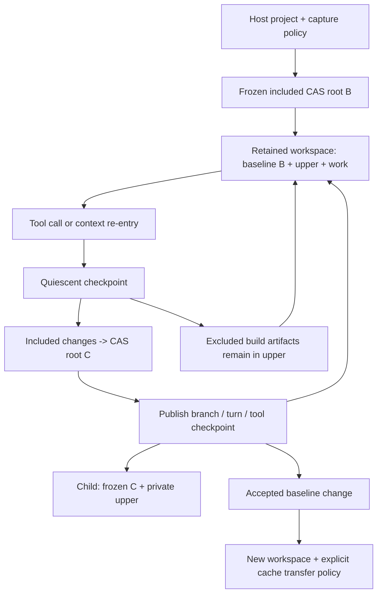

#### 11.3.9 Recovery and acceptance criteria

A retained upper is a workspace cache until its included changes are ingested.
Do not promise crash durability for excluded artifacts or uncheckpointed edits.
Recovery must distinguish a committed root, a recoverable backing workspace, and
an obsolete mount record. Reconcile retained upper state through trusted capture
before presenting it as a newer canonical result.

Acceptance checks must demonstrate that:

- Ignored build outputs survive repeated entry but do not enter published roots.
- Tracked files matching ignore patterns remain included, and explicit inclusions
  work without overriding secret exclusions.
- Included deletions and opaque-directory changes remain correct beside excluded
  artifacts.
- Repeated checkpoints preserve the baseline/upper relationship and do not create
  duplicate application of earlier changes.
- Both copied and metacopy baselines support the same retention and policy behavior.
- Secret paths, inherited descriptors, and environment credentials remain
  unavailable to tools, including after authenticated subagent admission.
- Writable cache exceptions do not grant writes elsewhere in the host filesystem.
- Re-entry reuses valid backing resources without host recapture, while conflicting
  writers and stale mount identities are rejected.
- Baseline changes create a new workspace and apply the selected artifact-retention
  policy without changing an active mount's lower.
- GC preserves objects pinned by retained workspaces and can remove discarded
  workspace caches independently of canonical project history.

### 11.4 Read-only inspection mounts

`fyai view mount NAME PATH` installs a persistent read-only overlay at an empty
directory, with `.fyai` covered by the empty read-only control-directory mount.
`fyai view unmount NAME` removes it. Mounted views reject entry and update.
The record stores the mount namespace identity, mount IDs, and root inode;
unmount checks these identities before removing any mount.

These operations require mount privileges in the current namespace. A rootless
inspection session can own a namespace without a daemon:

```sh
unshare -Urnm sh
fyai view mount experiment /tmp/experiment
fyai view mount comparison /tmp/comparison
diff -ru /tmp/experiment /tmp/comparison
fyai view unmount comparison
fyai view unmount experiment
exit
```

Unmount before leaving that shell. Mounts are visible in its namespace, and
stale records after an abandoned namespace require future recovery support.
A busy unmount retains its record for retry; it never uses lazy or forced unmount.

## 12. Implementation sequence and acceptance gates

1. Specify canonical schemas, hash encoding, byte-name representation, metadata
   policy, and storage-domain ownership. Add the narrowly scoped CAS blob exception
   to the repository architecture instructions.
2. Prototype native mounts with a small ordinary metadata tree, CAS data-only layer,
   private upper, and Landlock. Validate privileges and xattr control before integrating.
3. Implement immutable blob publication, Merkle capture, stat cache with racy-entry
   handling, monitor recovery, and bounded concurrent-capture retries.
4. Establish one execution-view adapter for direct tools, shell, terminal, agent
   delegation, and model-owned configured programs. Resolve writer lifecycle ownership.
5. Ingest final state, pin roots, publish branch/turn provenance, and implement GC.
6. Implement host reconciliation and recoverable application under the configured policy, defaulting to separate results.

Required tests include deterministic identity across processes; arbitrary filename
bytes; same-size/timestamp races; host edits during capture and execution; notification
overflow and new-directory races; content deduplication without accidental hard links;
whiteouts, opaque directories, metadata-only copy-up, and directory rename; direct-tool
and shell agreement; symlink/descriptor/backing-path bypass attempts; xattr forgery;
read-only outside metadata operations; arena publication without copy-up;
role-specific arena covers, reserved-path rejection, inherited mapping removal,
and supervisor-admitted delegation versus ordinary tool execution of fyai; cancellation
with surviving writers; interrupted blob publication and host application; and concurrent
publication/GC. Capability failure must be exercised as a failure path, not skipped into
unconfined execution.

From a tool, `umount <project>/.fyai`, `umount /tmp/.fyai-view-runtime`, and
`mount -o remount,rw /` must fail, also from a further `unshare -Urm`. Run these
cases with Landlock and with Landlock disabled for the test only, so that each
layer is proven alone.

The first supported scope is local project trees with ordinary files, directories,
and symlinks, no nested mounts, and supported metadata. Unsupported hard-link,
special-file, ACL, or xattr cases must be rejected or covered by an explicit implemented
policy. Commands beyond those of sections 11.2 and 11.4 are not specified by this
document. When implemented, use the command registry, schema validation, generated documentation, and sink result
presentation conventions.

## 13. Prior work and references

- [OverlayFS kernel documentation](https://docs.kernel.org/filesystems/overlayfs.html):
  mount semantics, data-only layers, control xattrs, and backing-layer constraints.
- [fanotify manual](https://man7.org/linux/man-pages/man7/fanotify.7.html) and
  [marking interface](https://man7.org/linux/man-pages/man2/fanotify_mark.2.html):
  monitoring scope, privileges, lost events, and coverage limitations.
- [Git racy-stat design](https://git-scm.com/docs/racy-git) and
  [index cache options](https://git-scm.com/docs/git-update-index): observation-cache
  invalidation and timestamp ambiguity. Reuse the design, not the user's Git index.
- [Composefs](https://github.com/composefs/composefs): reference implementation for
  metadata/data separation; its image-building path is outside this design.
- [OSTree object model](https://ostreedev.github.io/ostree/repo/): immutable filesystem
  manifests and directory metadata separation; no adoption of its repository format.
- [Landlock kernel documentation](https://docs.kernel.org/userspace-api/landlock.html):
  complementary access restrictions and ABI-dependent enforcement.

These references inform mechanisms. The acceptance tests establish which combinations
fyai actually supports; upstream feature descriptions are not evidence that a proposed
mount/security combination has been validated.
