# Software Design Document: credential isolation for agent transports

**Status:** Level B implemented; level A and full tool confinement remain planned
**Scope:** One fyai invocation and its complete agent tree on Linux

The diagrams use `M` for the main PID and `T` for the transport PID. Diagram
steps run from top to bottom. Solid arrows are requests or local actions;
dashed arrows are replies. A fork/exec arrow starts a process or replaces its
image and is not a transport-protocol message.

| Topic | Section |
| --- | --- |
| Process roles and root startup | [3.1](#31-implemented-roles), [3.2](#32-root-startup-timeline) |
| Channel and descriptor ownership | [3.3](#33-channels-and-descriptor-ownership) |
| Child and recursive admission | [3.4](#34-direct-sub-agent-admission-timeline), [3.5](#35-recursive-admission-timeline) |
| Control authority and sender verification | [4.1](#41-control-protocol-and-authority), [4.2](#42-registration-checks-and-per-message-checks) |
| Current and planned containment | [4.3](#43-implemented-level-b-and-planned-level-a) |
| Normal requests and tools | [5.3](#53-normal-model-and-tool-loop-timeline) |
| Credit, concurrency, cancellation, and retry | [5.4](#54-concurrent-requests-credit-cancellation-and-retry) |
| Configuration, reload, and configured commands | [5.5](#55-configuration-status-reload-and-configured-credentials) |
| Retirement and shutdown | [8](#8-failure-and-lifecycle) |

## 1. Purpose

Keep provider credentials out of every process that runs an agent or an
agent-controlled tool. A separate transport process authenticates provider
requests. Sections 3 through 5 describe the current process and message paths;
sections 2, 4.3, 6, and 7 identify guarantees that need further confinement. It accepts requests only from agents admitted to the current
invocation, and only for provider endpoints authorized by trusted invocation
configuration.

This is an invocation-local process group. It starts with a model-using fyai
invocation and exits with it. It is not a daemon and adds no durable process
state. Conversation and branch state remain in the existing libfyaml arenas.

## 2. Threat model and guarantees

Agent output, tool arguments, workspace contents, and tool programs are
untrusted. An agent may delegate recursively. A tool may try to read a
credential, inherit a transport descriptor, impersonate an agent, connect to
the transport, or send data to the network. Another process of the same user
may try to reach an invocation's transport.

The trusted computing base comprises the launcher/supervisor, transport,
agent runtime before it launches tools, Linux kernel enforcement, and the
credential resolver. Provider responses and agent-request content remain
untrusted data. Code execution inside the agent runtime itself is outside the
initial isolation guarantee; the transport still rejects requests sent by a
different process even if it acquired an agent's descriptor.

The complete protected-mode design requires these invariants. Current level B
does not enforce all credential-source and tool-confinement requirements:

1. No agent or tool process receives a raw credential through configuration,
   environment, arguments, inherited memory, file descriptors, or IPC.
2. Only the transport resolves credentials and adds authentication headers.
3. A model request is accepted only from a live, registered agent in this
   invocation's protected Linux security context.
4. A registered agent can request only the model, grammar, and provider
   endpoint granted to its execution. The request cannot override URL,
   proxy, headers, or authentication.
5. Tools receive no transport channel. A leaked channel alone cannot
   authenticate a request from a tool or unrelated process.
6. Failure to establish or verify a required boundary stops the protected
   invocation. There is no direct-network fallback for agent requests.

This design protects fyai's credentials, not arbitrary data the agent is
permitted to read. A model may include accessible workspace data in a provider
request. Separate tool network and filesystem restrictions are required to
prevent direct exfiltration by tool programs; the credential transport does
not substitute for them.

## 3. Process model and startup

### 3.1 Implemented roles

The current implementation uses one main process for the user session, the
supervisor duties, and the root agent. These are three roles in one PID, not
three processes. The bootstrap is the first image of that same PID. It
executes fyai again after it has started the transport and registered itself.
The new image retains the PID and its transport registration, but discards the
bootstrap address space.

The credential transport is a separate child process. Each executed sub-agent
is a separate child of the agent that delegates to it. A grandchild is thus a
child of its delegating sub-agent, not a direct child of the main process. All
agents use the same invocation-local transport.

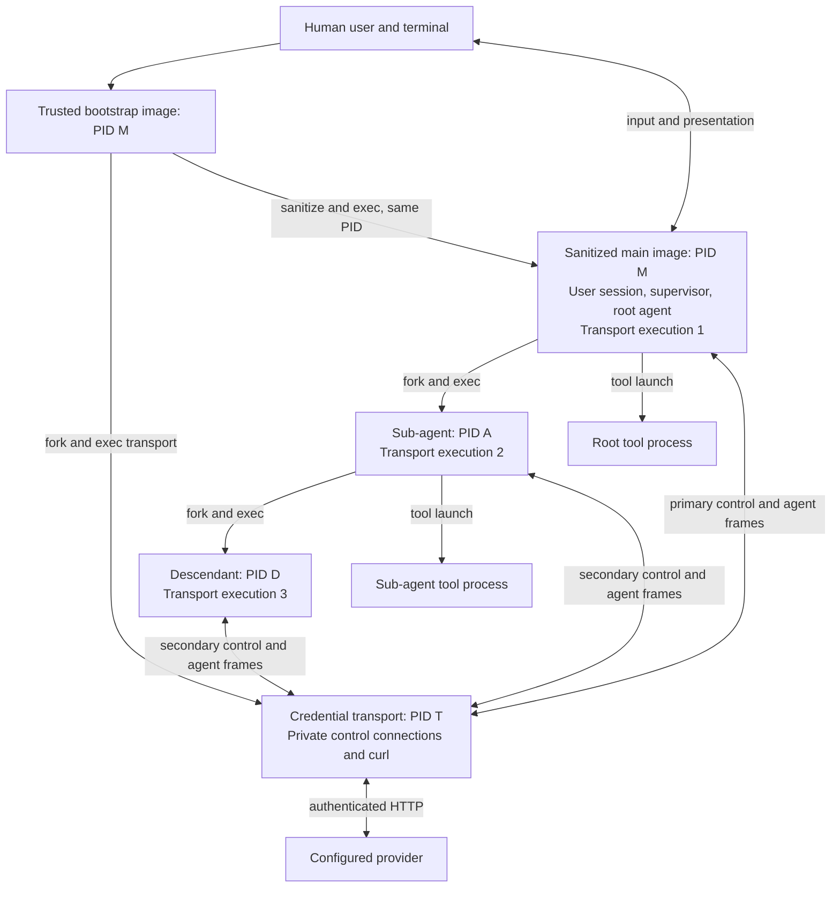
```mermaid
flowchart TB
    U[Human user and terminal]
    B[Trusted bootstrap image: PID M]
    M[Sanitized main image: PID M<br/>User session, supervisor, root agent<br/>Transport execution 1]
    T[Credential transport: PID T<br/>Private control connections and curl]
    A[Sub-agent: PID A<br/>Transport execution 2]
    D[Descendant: PID D<br/>Transport execution 3]
    W[Root tool process]
    X[Sub-agent tool process]
    P[Configured provider]
    U --> B
    B -->|fork and exec transport| T
    B -->|sanitize and exec, same PID| M
    U <-->|input and presentation| M
    M -->|fork and exec| A
    A -->|fork and exec| D
    M -->|tool launch| W
    A -->|tool launch| X
    M <-->|primary control and agent frames| T
    A <-->|secondary control and agent frames| T
    D <-->|secondary control and agent frames| T
    T <-->|authenticated HTTP| P
```

The diagram shows process ownership and message paths. It does not imply
that a tool can use a transport connection. The transport never starts an
agent or a tool. It owns the execution registry, profile set, credentials,
curl handles, and active transfers. The main process owns the UI, its model
and tool loop, and the lifetime of the transport. Each parent owns the job,
result collection, and reaping of its direct sub-agents.

A transport execution ID is distinct from an agent-tree execution ID, a
branch name, a PID, and a provider request ID. The root transport execution
is 1. Child admissions with `id: 0` take the next transport execution ID,
starting at 2. These IDs and channels do not enter persistent arena state.

### 3.2 Root startup timeline

Startup applies only to a model-using invocation with transport isolation
selected. A non-model command does not start a transport. An already
supervised image and an executed tool child do not bootstrap another one.
`none` keeps the direct transport path. On Linux, `auto` currently selects
`level-b`; explicit `level-a` fails because cgroup setup is not implemented.
Valgrind and an unavailable self-execution path also stop isolated startup.

The bootstrap loads the invocation configuration and resolves the initial
credential through the existing setup path. It can therefore hold credential
bytes. It creates the primary control socketpair and the root agent socketpair
before it forks the transport. The transport child executes `fyai transport
--control-fd FD`; its arguments contain no raw key.

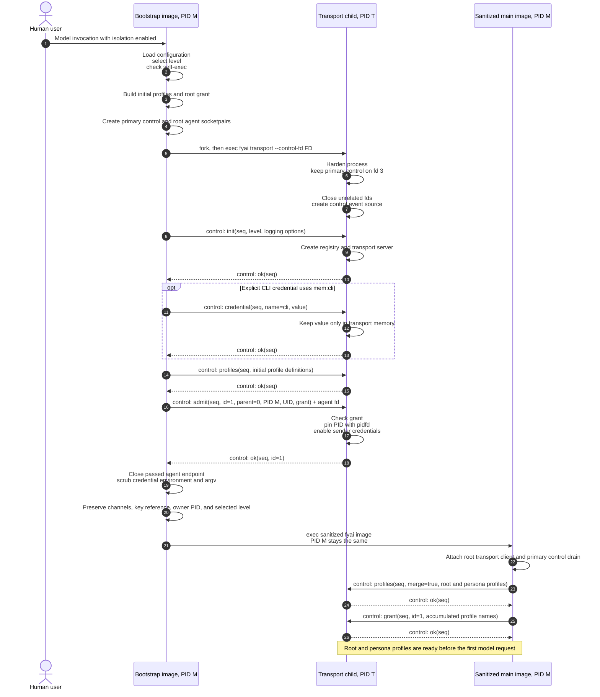
```mermaid
sequenceDiagram
    autonumber
    actor U as Human user
    participant B as Bootstrap image, PID M
    participant T as Transport child, PID T
    participant M as Sanitized main image, PID M
    U->>B: Model invocation with isolation enabled
    B->>B: Load configuration<br/>select level<br/>check self-exec
    B->>B: Build initial profiles and root grant
    B->>B: Create primary control and root agent socketpairs
    B->>T: fork, then exec fyai transport --control-fd FD
    T->>T: Harden process<br/>keep primary control on fd 3
    T->>T: Close unrelated fds<br/>create control event source
    B->>T: control: init(seq, level, logging options)
    T->>T: Create registry and transport server
    T-->>B: control: ok(seq)
    opt Explicit CLI credential uses mem:cli
        B->>T: control: credential(seq, name=cli, value)
        T->>T: Keep value only in transport memory
        T-->>B: control: ok(seq)
    end
    B->>T: control: profiles(seq, initial profile definitions)
    T-->>B: control: ok(seq)
    B->>T: control: admit(seq, id=1, parent=0, PID M, UID, grant) + agent fd
    T->>T: Check grant<br/>pin PID with pidfd<br/>enable sender credentials
    T-->>B: control: ok(seq, id=1)
    B->>B: Close passed agent endpoint<br/>scrub credential environment and argv
    B->>B: Preserve channels, key reference, owner PID, and selected level
    B->>M: exec sanitized fyai image<br/>PID M stays the same
    M->>M: Attach root transport client and primary control drain
    M->>T: control: profiles(seq, merge=true, root and persona profiles)
    T-->>M: control: ok(seq)
    M->>T: control: grant(seq, id=1, accumulated profile names)
    T-->>M: control: ok(seq)
    Note over M,T: Root and persona profiles are ready before the first model request
```

Every startup control call waits for `ok` or `error` before the bootstrap
continues. Root admission precedes the sanitized `exec()`. The registered PID
and pidfd remain valid across that `exec()`, so there is no second root
admission. `fyai_transport_attach()` takes over the retained descriptors in
the new image. `fyai_transport_ensure()` adds configured persona profiles and
updates the root grant before the first request.

The bootstrap sends a raw CLI key only on the private primary control
connection, as a `credential` message. An environment or secret-store source
remains a reference in the profile. The transport resolves that reference for
an authenticated request. The new main image receives the reference, such as
`mem:cli`, and never receives the CLI key value.

The transport sets itself undumpable, disables core dumps, enables
no-new-privileges and a parent-death signal, moves its primary channel to fd
3, closes unrelated descriptors, and leaves the terminal session. This
hardening occurs before it processes the control protocol. The transport has
no listening socket, opens no conversation arena, and never forks a child
after it has read a credential.

If a handshake or sanitization step fails, the bootstrap stops startup,
terminates and reaps the transport if it was started, closes the socketpairs,
and reports the cause. It does not execute an agent with a partly established
transport boundary.

### 3.3 Channels and descriptor ownership

There are three IPC protocols: transport control, agent frames, and job RPC. Their identifiers and replies must not
be mixed.

| Path | Endpoints | Protocol and purpose |
| --- | --- | --- |
| Primary transport control | Main process and transport | JSON mapping per `SOCK_SEQPACKET` datagram; startup, profile changes, root grant, status, events, shutdown |
| Secondary transport control | One sub-agent and transport | Same control protocol; operations limited to its logical execution subtree |
| Agent data | One admitted agent and transport | Binary framed requests, response bytes, credit, and cancellation |
| Parent-child job control | Parent agent and direct sub-agent | JSON-RPC over pipes; `tool/run`, spawn state, progress, results, and diagnostics |

The two transport socketpairs and the job pipes have different ownership.
A parent passes transport-side socket endpoints through `SCM_RIGHTS`; it does
not forward the child's provider stream through its own job pipes. The child
has an independent agent channel and receives its response directly.

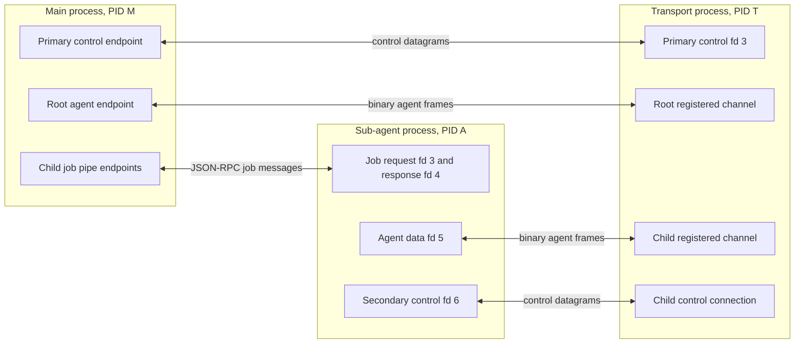
```mermaid
flowchart LR
    subgraph MAIN[Main process, PID M]
        MC[Primary control endpoint]
        MA[Root agent endpoint]
        MJ[Child job pipe endpoints]
    end
    subgraph CHILD[Sub-agent process, PID A]
        CJ[Job request fd 3 and response fd 4]
        CA[Agent data fd 5]
        CC[Secondary control fd 6]
    end
    subgraph TRANSPORT[Transport process, PID T]
        TC[Primary control fd 3]
        TA[Root registered channel]
        TD[Child registered channel]
        TS[Child control connection]
    end
    MC <-->|control datagrams| TC
    MA <-->|binary agent frames| TA
    MJ <-->|JSON-RPC job messages| CJ
    CA <-->|binary agent frames| TD
    CC <-->|control datagrams| TS
```

Descriptor numbers are local to a process. The transport's fd 3 and the
sub-agent's fd 3 are unrelated. The main process's retained channel numbers
are recorded in invocation environment variables and need not be 5 and 6.
Executed sub-agents use fixed fds 3 and 4 for job RPC and 5 and 6 for transport.
They close unrelated inherited descriptors before execution. Ordinary tool
children receive no agent or transport-control endpoint.

Control `seq` matches a reply to a control request. Job JSON-RPC IDs match
parent-child calls. An agent frame carries a transport execution ID, a
request ID scoped to its agent channel, and a sequence within the framed
message or response. Equal request IDs on different agent channels identify
different transfers.

### 3.4 Direct sub-agent admission timeline

The parent checks the normal branch, name, and agent-tree limits before it
submits a delegation. Under transport isolation, it must use an executed
sub-agent. A configured `agent/spawn: fork` is treated as exec. A transient
run, a pinned root, or another condition that prevents this exec path makes
the delegation fail; there is no isolated fork fallback.

The parent creates both job pipes, an optional PTY, and two transport
socketpairs before it forks. Parent and child can run in either order after
the fork. The child may complete exec before registration, but its trusted
runtime waits for `tool/run`. This wait is the admission barrier; the kernel
does not suspend the child until admission.

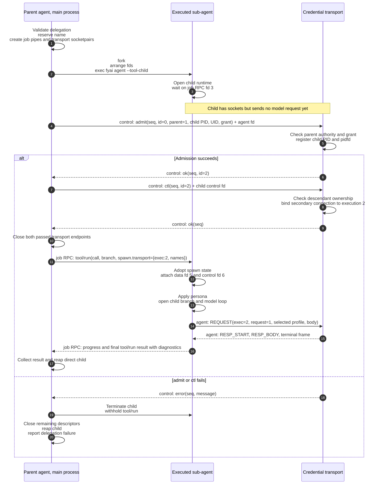
```mermaid
sequenceDiagram
    autonumber
    participant M as Parent agent, main process
    participant A as Executed sub-agent
    participant T as Credential transport
    M->>M: Validate delegation<br/>reserve name<br/>create job pipes and transport socketpairs
    M->>A: fork<br/>arrange fds<br/>exec fyai agent --tool-child
    A->>A: Open child runtime<br/>wait on job RPC fd 3
    Note over A,T: Child has sockets but sends no model request yet
    M->>T: control: admit(seq, id=0, parent=1, child PID, UID, grant) + agent fd
    T->>T: Check parent authority and grant<br/>register child PID and pidfd
    alt Admission succeeds
        T-->>M: control: ok(seq, id=2)
        M->>T: control: ctl(seq, id=2) + child control fd
        T->>T: Check descendant ownership<br/>bind secondary connection to execution 2
        T-->>M: control: ok(seq)
        M->>M: Close both passed transport endpoints
        M->>A: job RPC: tool/run(call, branch, spawn.transport={exec:2, names})
        A->>A: Adopt spawn state<br/>attach data fd 5 and control fd 6
        A->>A: Apply persona<br/>open child branch and model loop
        A->>T: agent: REQUEST(exec=2, request=1, selected profile, body)
        T-->>A: agent: RESP_START, RESP_BODY, terminal frame
        A-->>M: job RPC: progress and final tool/run result with diagnostics
        M->>M: Collect result and reap direct child
    else admit or ctl fails
        T-->>M: control: error(seq, message)
        M->>A: Terminate child<br/>withhold tool/run
        M->>M: Close remaining descriptors<br/>reap child<br/>report delegation failure
    end
```

`admit` and `ctl` are separate requests. `admit` registers the agent data
channel and returns the transport execution ID. `ctl` attaches a secondary
control connection to that admitted execution. The parent sends `tool/run`
only after both replies succeed. If `ctl` fails after `admit` succeeded, the
parent kills the waiting child and closes its endpoints; the transport retires
the data channel when it closes. No model request is released in this path.

The spawn state contains the transport execution ID and granted profile
names, together with the normal branch and configuration state. Under
isolation, it carries no raw provider key. Its transport ID does not replace
the separate agent-tree identity that normal job accounting uses.

### 3.5 Recursive admission timeline

A sub-agent admits its own child through its secondary connection. Admission
does not travel through the main process. The transport checks the logical
parent chain and constrains the granted profile names to the caller's names.
The parent
runtime still owns the usual branch and delegation-limit checks.

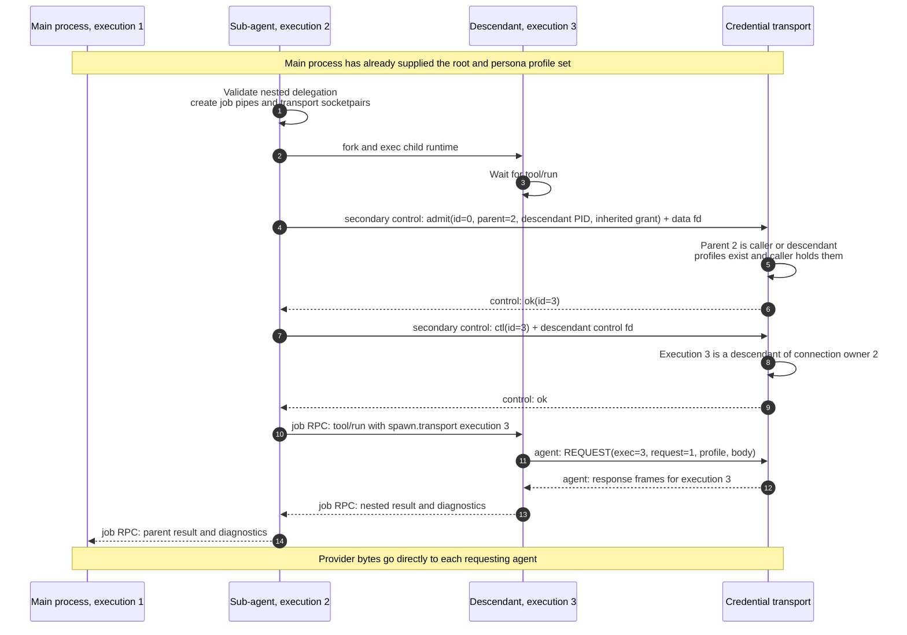
```mermaid
sequenceDiagram
    autonumber
    participant M as Main process, execution 1
    participant A as Sub-agent, execution 2
    participant D as Descendant, execution 3
    participant T as Credential transport
    Note over M,T: Main process has already supplied the root and persona profile set
    A->>A: Validate nested delegation<br/>create job pipes and transport socketpairs
    A->>D: fork and exec child runtime
    D->>D: Wait for tool/run
    A->>T: secondary control: admit(id=0, parent=2, descendant PID, inherited grant) + data fd
    T->>T: Parent 2 is caller or descendant<br/>profiles exist and caller holds them
    T-->>A: control: ok(id=3)
    A->>T: secondary control: ctl(id=3) + descendant control fd
    T->>T: Execution 3 is a descendant of connection owner 2
    T-->>A: control: ok
    A->>D: job RPC: tool/run with spawn.transport execution 3
    D->>T: agent: REQUEST(exec=3, request=1, profile, body)
    T-->>D: agent: response frames for execution 3
    D-->>A: job RPC: nested result and diagnostics
    A-->>M: job RPC: parent result and diagnostics
    Note over M,T: Provider bytes go directly to each requesting agent
```

A secondary connection can admit a child whose logical parent is itself or
one of its descendants. It can attach control connections and change grants
only for descendants. It can retire itself or descendants. It cannot change
its own grant, act on an ancestor or sibling, change profile definitions,
set credentials, change logs, request `envgrant`, or shut down the transport.

The normal spawn path gives a child the profile names its parent holds. It
does not copy an optional model override from the parent grant. Control
authority checks compare profile names; they do not check inheritance of
optional grant model overrides. Profile-level model restrictions still apply
to every request. Those
names can include every configured persona provider. The child's model request
still has to name a granted profile; possessing a name does not allow the
child to redefine its endpoint or credential source. A sub-agent whose stored
provider has no profile in the root or persona configuration fails when it
requests that profile.

## 4. Admission, authority, and containment

### 4.1 Control protocol and authority

A control request is one JSON mapping with `op` and `seq`, bounded to 64 KiB.
It can carry one descriptor with `SCM_RIGHTS`. A reply is `ok` or `error` with
the request's `seq`; an error contains a diagnostic `message`. Extra success
fields include an admission `id`, a status snapshot, or a probe `found`
boolean. Control replies do not currently carry the C helper's integer
return code. The implementation uses that code to choose the reply kind.

Control authorization comes from possession of the private connection and,
for a secondary connection, its transport execution owner. Per-message
`SCM_CREDENTIALS` and PID verification apply to the agent data channels. They
must not be assumed to authenticate the control protocol. Closing control
endpoints in tool children is therefore part of the boundary.

| Request | Fields and effect | Authority |
| --- | --- | --- |
| `init` | `level`, optional `cgroup`, `log`, `wire`, `whitewash`; create registry and server, once | Primary only; first request |
| `credential` | `name`, `value`; store `mem:NAME` in transport memory | Primary only |
| `profiles` | Profile definitions; replace set, or add with `merge: true` | Primary only |
| `admit` | `id`, `parent`, `pid`, `uid`, `grant`, optional `ns`, plus agent fd; register execution | Primary, or secondary acting within its subtree and profile names |
| `ctl` | Admitted execution `id`, plus control fd; bind connection owner | Primary, or secondary for a descendant |
| `grant` | Execution `id` and profile-name grant; replace that grant | Primary, or secondary for a descendant within caller profile names |
| `retire` | Execution `id`; close registered data channel and active transfers | Primary, or secondary for itself or descendants |
| `status` | Return level, transport PID, executions, profiles, active transfers, log settings | Any control connection |
| `probe` | Credential source reference; return `found`, never a value | Any control connection |
| `envgrant` | At most 16 environment-variable names and a socket for a configured command | Primary only |
| `log` | `on`, `wire`, `whitewash`; update logging | Primary only |
| `shutdown` | Stop the invocation's transport | Primary only |

Unsolicited `event` mappings report rejected messages and retired executions
to the primary connection. They contain `id`, `event`, and `detail`, not
provider bodies. Sending an event is nonblocking; a full control socket can
drop it. The transport log, when enabled, records server events separately.
The main event-loop drain traces control events. A synchronous control caller
skips event messages while it waits for its reply.

A credential source is `env:NAME`, `secret:NAME`, `mem:NAME`, or
`oauth:chatgpt`, or a chain separated by `|` that is tried in order. The provider default uses an
environment source followed by the secret-store source. Agents keep only the
reference. In an isolated agent image, secret-store and provider-default
resolution does not load the raw model credential into the agent.

### 4.2 Registration checks and per-message checks

Admission validates the requested ID, parent authority, grant, process
identity, and channel. The registry rejects a duplicate execution ID, PID, or
channel. It opens a pidfd while the parent has not reaped the child, enables
`SO_PASSCRED` on the agent channel, and checks any requested containment. A
namespace requirement must differ from the transport's namespace at admission.

Every agent datagram then has an independent verification path. The channel
selects the registered execution. Kernel-supplied `SCM_CREDENTIALS` must name
that execution's exact PID and UID, and the pidfd must still identify a live
process. The transport also checks declared namespaces and, for level A,
cgroup membership. Only then does it parse the frame and verify the execution
ID, kind, sequence, size bounds, and fragment order. A complete request is
checked against the execution's profile and model grant before curl starts.

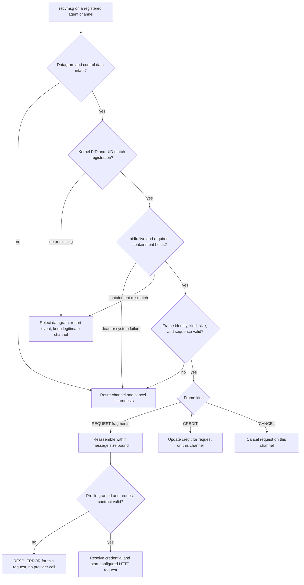
```mermaid
flowchart TD
    R[recvmsg on a registered agent channel] --> L{Datagram and control data intact?}
    L -->|no| F[Retire channel and cancel its requests]
    L -->|yes| C{Kernel PID and UID match registration?}
    C -->|no or missing| J[Reject datagram, report event, keep legitimate channel]
    C -->|yes| P{pidfd live and required containment holds?}
    P -->|dead or system failure| F
    P -->|containment mismatch| J
    P -->|yes| H{Frame identity, kind, size, and sequence valid?}
    H -->|no| F
    H -->|yes| K{Frame kind}
    K -->|REQUEST fragments| A[Reassemble within message size bound]
    K -->|CREDIT| B[Update credit for request on this channel]
    K -->|CANCEL| D[Cancel request on this channel]
    A --> G{Profile granted and request contract valid?}
    G -->|no| E[RESP_ERROR for this request, no provider call]
    G -->|yes| Q[Resolve credential and start configured HTTP request]
```

`SO_PEERCRED` at socket creation is insufficient because a descriptor can be
copied or passed later. An ordinary tool with a copied data endpoint sends
its own kernel PID and is rejected. A claimed execution ID in a frame is not
authorization. A valid PID does not grant access to every profile. Data-frame
checks and control-connection authority are separate mechanisms.

A wrong sender, missing sender credentials, or containment mismatch is logged
and dropped without terminating a legitimate sender's channel. Corrupt
framing, a dead registration, or a channel failure retires the channel.
A well-framed request that violates its grant receives a terminal error
without an HTTP request.

### 4.3 Implemented level B and planned level A

| Configuration | Current startup behavior | Data-channel checks |
| --- | --- | --- |
| `none` | No isolated transport | Direct model transfer path |
| `level-b` | Start transport | Exact PID and UID, live pidfd, registered channel, frame and grant checks |
| `auto` | Select and report level B | Same checks as `level-b` |
| `level-a` | Reject startup; cgroup setup is not available | Registry support exists, but bootstrap cannot establish the required subtree |

Level B does not confine descendants, restrict their network, or prevent an
agent from reading every same-user credential store. It separates the normal
model credential path and authenticates agent data messages. The stronger
filesystem and network policy in sections 2 and 6 remains required work.

For level A, the planned supervisor must obtain a protected writable cgroup
v2 subtree, place each child before release, and retain authority over it.
Agents and tools must not receive permission to move themselves or other
processes. The transport remains outside the subtree. Cgroup membership is
an additional check; it cannot replace the exact PID check because a tool
initially inherits its agent's cgroup.

Optional namespace registration records the inodes for network, mount, and
PID namespaces. The registry requires them to differ from the transport's
namespaces and verifies them on agent messages. The current bootstrap and
normal child admission do not create these namespaces. A future filesystem
view must bind the shared arena directly; overlay copy-up would make a private
arena copy and break shared publication.

The following timeline is a level-A requirement, not a currently available
startup path:

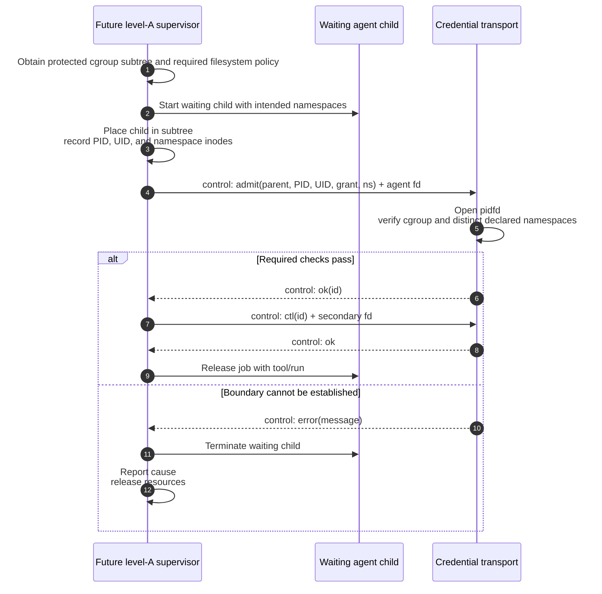
```mermaid
sequenceDiagram
    autonumber
    participant S as Future level-A supervisor
    participant A as Waiting agent child
    participant T as Credential transport
    S->>S: Obtain protected cgroup subtree and required filesystem policy
    S->>A: Start waiting child with intended namespaces
    S->>S: Place child in subtree<br/>record PID, UID, and namespace inodes
    S->>T: control: admit(parent, PID, UID, grant, ns) + agent fd
    T->>T: Open pidfd<br/>verify cgroup and distinct declared namespaces
    alt Required checks pass
        T-->>S: control: ok(id)
        S->>T: control: ctl(id) + secondary fd
        T-->>S: control: ok
        S->>A: Release job with tool/run
    else Boundary cannot be established
        T-->>S: control: error(message)
        S->>A: Terminate waiting child
        S->>S: Report cause<br/>release resources
    end
```

## 5. Transport request contract

An agent sends a bounded, versioned request containing its execution ID,
request ID, selected profile, and provider-formatted HTTP body. The agent
builds the body through the existing provider request builder; the transport
does not build a canonical conversation or interpret provider stream events.
A response carries HTTP metadata and ordered provider bytes. The agent derives
content, tool calls, completion, errors, and usage from those bytes. A cancel message names an
outstanding request on the same agent channel. Framing preserves streaming
and applies backpressure; a slow agent cannot make the transport buffer an
unbounded response.

The transport is an allow-listed egress proxy. The profile chooses the
destination; payload content cannot choose a new endpoint. Two objects decide what a request can reach.

A **profile** is one destination. It has a name, an exact endpoint, an
authentication method (none, bearer, or a named header), and the name of a
credential source that only the transport resolves. It can also carry an
opaque tag and model name that the agent uses to parse the response, and fixed
non-secret header lines. The transport holds one set of profiles. The
primary connection can replace the set; normal configuration updates merge
profiles into it:
an agent can change its model or its provider, and a catalogue update can move
an endpoint. A request in flight keeps the profile it started with; the next
request sees the new set. An endpoint must be https, with two exceptions.
A loopback endpoint can use http, with or without authentication: the credential does not leave the host.
Any other http endpoint needs the `plain_http` flag on its profile, which the
trusted configuration sets when the user chose an `http://` URL. Local model
servers on a network or in a container are usually reached that way, and the
transport cannot decide from a host name whether a host is local. The request
event of the transport log names a plain-http request. This also lets the test
mock server take a key.

A **grant** belongs to one execution. It lists the profile names that the
execution can use, and for each name it can narrow the model. It holds names,
not definitions, so a reload of the profiles does not touch the grants. The
supervisor changes the grant of one execution when its agent changes provider
or model. An execution with an empty grant can reach nothing. A grant can
narrow the model of a profile and cannot widen it.

A request names a profile. It never names a URL, a header, or a credential.
Model provider requests use this path. MCP HTTP and OAuth operations need
separate integration before they can use it; they are not routed through the
model transport by this series.

The transport derives the URL, authentication method, and required headers
from the profile, after it checks that the grant of the execution names it. It
rejects raw URLs, arbitrary headers, proxy settings, credentials, curl options,
and redirects in agent requests. Any change of model or endpoint comes from the
supervisor, using trusted configuration; a branch or model tool message cannot
expand a grant. The transport validates the final HTTPS origin, keeps TLS
peer and hostname verification enabled, disables URL redirects and ambient
proxy environment settings, and permits only the configured endpoint.
A profile with no authentication never receives a credential.

Transport curl handles and their connection pool stay inside the transport.
The existing event-loop curl multi implementation runs there. The agent
receives provider response bytes through IPC and parses them into the existing
provider-stream generics; canonical turn identity remains provider independent.
Cancellation, timeout, retry, and transient error semantics must preserve the
current behavior, including the no-retry-after-visible-content rule.

The transport runs as a verb of fyai, `fyai transport`, that the
bootstrap starts with `exec()`. It reads its startup state from a private
descriptor and takes no positional argument. It opens no arena.

A request payload has a 32-bit little-endian length, a JSON header, and the
body bytes. The header has a `profile` and only these optional fields:
`method` (`POST` or `GET`), `content_type`, `accept`, and `timeout_ms`. Any
other field, and any value outside the allowed list, refuses the request with
a terminal error frame. A profile can also name a model. The transport then
requires that the JSON body names that model. A profile can carry fixed
non-secret header lines, such as a protocol version, from trusted
configuration. The transport adds `Expect:` with no value so that curl does
not wait for an interim reply.

### 5.1 Streaming behavior

The transport does not wait for the complete HTTP response. Its curl header
and write callbacks enqueue frames as data arrives. Each frame carries the
execution ID, request ID, a monotonically increasing sequence number, and a
kind: response start, body chunk, response end, or transport error. Response
start includes the HTTP status and only the response metadata the agent needs
to parse the provider stream or honor `Retry-After`. It never includes request
headers. Body chunks carry exact provider bytes in arrival order; the agent's
existing grammar parser turns them into provider-stream generics and drives
live presentation. Chunks are transport units, not provider event boundaries:
the parser must accept an event split across frames or several events in one
frame.

Each request starts with a credit window of 256 KiB of body. The agent sends a
credit frame, a 32-bit count of bytes, when it has consumed data. A curl write
callback sends one whole frame or none. If credit is short, or the socket of
the agent is full, it returns the pause code, and curl gives the same bytes
again after the transfer resumes. The transport holds no response data. A
failed send of a terminal frame is queued and sent when the socket is
writable, so a request always ends with one terminal frame.

Frames from concurrent agents or requests may interleave on the transport's
event loop, but sequence numbers and request IDs preserve order within each
response. The agent acknowledges consumed bytes or advances an explicit
credit window. When body delivery cannot proceed, the transport pauses that curl receive
path and resumes it when credit and socket capacity permit.
It never accumulates an unbounded response in memory. A slow agent can delay
its own transfer without blocking unrelated agent streams. A closed agent
channel cancels its active transfers and discards their queued frames.

Providers limit their rate. The transport records the rate-limit headers of
each response (`x-ratelimit-*`, `anthropic-ratelimit-*`, and `ratelimit-*`),
with the status and `Retry-After`. It keeps the latest record for each
endpoint, writes a trace line, and reports the headers to the agent in the
response start frame. It does not act on them: it adds no delay, no retry, and
no refusal, and a 429 is an ordinary response. The agent applies the existing
retry policy.

A request has exactly one terminal frame. Cancellation carries the request ID
on the same authenticated channel; the transport removes the curl transfer
and returns a cancelled terminal frame when the channel remains open. A
transport failure after body bytes have reached the agent preserves those
bytes and reports the original error; it does not restart the request and
duplicate visible content. A transient failure before any content is
presented may use the existing bounded backoff policy. Stream-level provider
errors are parsed by the agent; the retry decision and original error text
must cross the IPC boundary without losing the current semantics.

The agent keeps the assistant document open through the model and tool loop,
as it does today. Streaming frames feed that document and the sink; tool
results can lead to another request on the same or another agent channel.
Only canonical completed turns are published to the arena. The transport
holds no conversation state after the invocation ends.

The agent data protocol must never include a raw credential. The private
primary control protocol has the explicit `credential` and `envgrant`
exceptions described in sections 3.2 and 5.5. Diagnostics, trace
logs, and transport errors must redact authorization material. The transport
must not send its environment, headers, or credential resolver output to an
agent.

### 5.2 Logging

The `log` verb has a `transport` target, `logging/transport` in the
configuration. When it is on, the transport writes `.fyai/logs/transport.yaml`:
one record for each admission, request, response start, end, error, cancel,
rejected message, and retirement, and the raw traffic of each transfer. The
transport runs a redactor over every record before it writes it, and the
redactor learns each credential when the transport resolves it. It whites out:

- the value of `Authorization`, `Proxy-Authorization`, `X-Api-Key`, `Api-Key`,
  `X-Goog-Api-Key`, `Cookie`, `Set-Cookie`, and of the header that a profile
  names for its credential;
- a bearer token anywhere in the text; and
- each occurrence of a credential that the transport read, because a provider
  can echo a key in a body or in an error.

The redaction keeps the length of the text. The `whitewash_api_keys` setting
does not apply to the transport log: it is always on. The wire log of an
unprotected run uses the same redactor for every record type, and adds the
API key of the run to the secrets. The complete protected-mode filesystem policy must deny the transport log
directory to agents and tools, as it must deny credential sources. Level B
does not currently install that policy.

### 5.3 Normal model and tool-loop timeline

The main process and each sub-agent own a model loop. Each builds its request
in its own provider grammar and sends it through its own data channel. The
transport adds authentication and runs HTTP. The requesting agent parses the
provider stream, renders or forwards progress according to its normal output
policy, executes requested tools, and publishes its branch state.

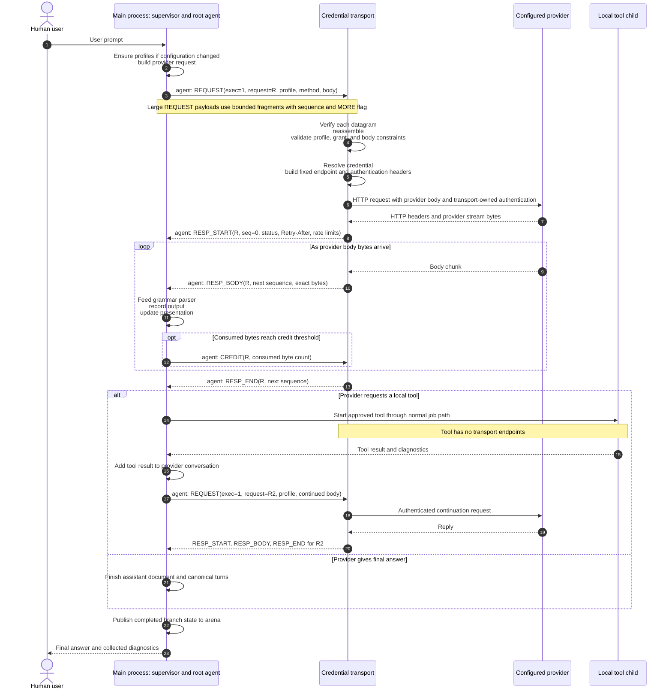
```mermaid
sequenceDiagram
    autonumber
    actor U as Human user
    participant M as Main process: supervisor and root agent
    participant T as Credential transport
    participant P as Configured provider
    participant W as Local tool child
    U->>M: User prompt
    M->>M: Ensure profiles if configuration changed<br/>build provider request
    M->>T: agent: REQUEST(exec=1, request=R, profile, method, body)
    Note over M,T: Large REQUEST payloads use bounded fragments with sequence and MORE flag
    T->>T: Verify each datagram<br/>reassemble<br/>validate profile, grant, and body constraints
    T->>T: Resolve credential<br/>build fixed endpoint and authentication headers
    T->>P: HTTP request with provider body and transport-owned authentication
    P-->>T: HTTP headers and provider stream bytes
    T-->>M: agent: RESP_START(R, seq=0, status, Retry-After, rate limits)
    loop As provider body bytes arrive
        P-->>T: Body chunk
        T-->>M: agent: RESP_BODY(R, next sequence, exact bytes)
        M->>M: Feed grammar parser<br/>record output<br/>update presentation
        opt Consumed bytes reach credit threshold
            M->>T: agent: CREDIT(R, consumed byte count)
        end
    end
    T-->>M: agent: RESP_END(R, next sequence)
    alt Provider requests a local tool
        M->>W: Start approved tool through normal job path
        Note over W,T: Tool has no transport endpoints
        W-->>M: Tool result and diagnostics
        M->>M: Add tool result to provider conversation
        M->>T: agent: REQUEST(exec=1, request=R2, profile, continued body)
        T->>P: Authenticated continuation request
        P-->>T: Reply
        T-->>M: RESP_START, RESP_BODY, RESP_END for R2
    else Provider gives final answer
        M->>M: Finish assistant document and canonical turns
    end
    M->>M: Publish completed branch state to arena
    M-->>U: Final answer and collected diagnostics
```

A sub-agent uses the same request and response sequence with its own execution
and channel. Its parent receives job progress and the tool result through
JSON-RPC. If the sub-agent has a PTY, its own sink renders there and the parent
shows that terminal. The transport does not render terminal output, assemble
assistant documents, run tools, or publish branches.

A response body frame is not necessarily one SSE event, one JSON document,
or one text token. The provider parser must handle split events and multiple
events in one chunk. Response sequence numbers start at 0 for each request;
the client rejects a missing, repeated, or out-of-order frame. A response
without body bytes still carries response-start metadata before its end.

The normal success path has one terminal `RESP_END`. A request or transport
failure uses one terminal `RESP_ERROR`. A provider HTTP error, such as 429,
can still complete the transport successfully with `RESP_END`: its HTTP
status and body give the agent the provider failure. A control `ok` reply
acknowledges a control operation and is not a model response.

### 5.4 Concurrent requests, credit, cancellation, and retry

Each transfer starts with 256 KiB of body credit. The client returns credit
when consumed body bytes reach 64 KiB. `CREDIT` contains a four-byte
little-endian count and names the request on that agent's channel. It does
not grant a profile or acknowledge a control operation.

The curl body callback sends the whole chunk or pauses without consuming it.
Insufficient credit or a full agent socket pauses only that transfer. Credit
or socket writability allows a retry of the same chunk. Pending response-start
and terminal metadata is bounded; the server flushes it before it resumes a
paused body. It does not queue an unbounded copy of provider bodies.

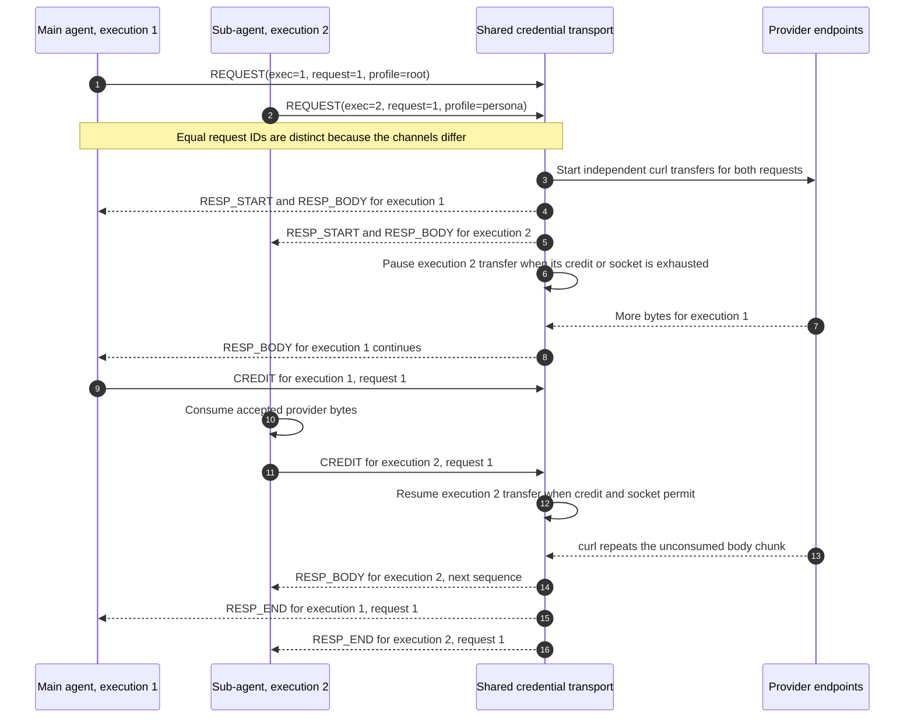
```mermaid
sequenceDiagram
    autonumber
    participant M as Main agent, execution 1
    participant A as Sub-agent, execution 2
    participant T as Shared credential transport
    participant P as Provider endpoints
    M->>T: REQUEST(exec=1, request=1, profile=root)
    A->>T: REQUEST(exec=2, request=1, profile=persona)
    Note over M,T: Equal request IDs are distinct because the channels differ
    T->>P: Start independent curl transfers for both requests
    T-->>M: RESP_START and RESP_BODY for execution 1
    T-->>A: RESP_START and RESP_BODY for execution 2
    T->>T: Pause execution 2 transfer when its credit or socket is exhausted
    P-->>T: More bytes for execution 1
    T-->>M: RESP_BODY for execution 1 continues
    M->>T: CREDIT for execution 1, request 1
    A->>A: Consume accepted provider bytes
    A->>T: CREDIT for execution 2, request 1
    T->>T: Resume execution 2 transfer when credit and socket permit
    P-->>T: curl repeats the unconsumed body chunk
    T-->>A: RESP_BODY for execution 2, next sequence
    T-->>M: RESP_END for execution 1, request 1
    T-->>A: RESP_END for execution 2, request 1
```

Cancellation of a live transfer uses the agent data channel. It names a
request within that channel and passes the same sender checks as a request.
The transport cancels the curl transfer and reports cancellation with
`RESP_ERROR` code -2 while the channel is available. The client maps this to
the existing cancelled result. A locally aborted callback can end its call
before the transport's cancellation frame arrives; the client does not deliver
a second completion callback for that call.

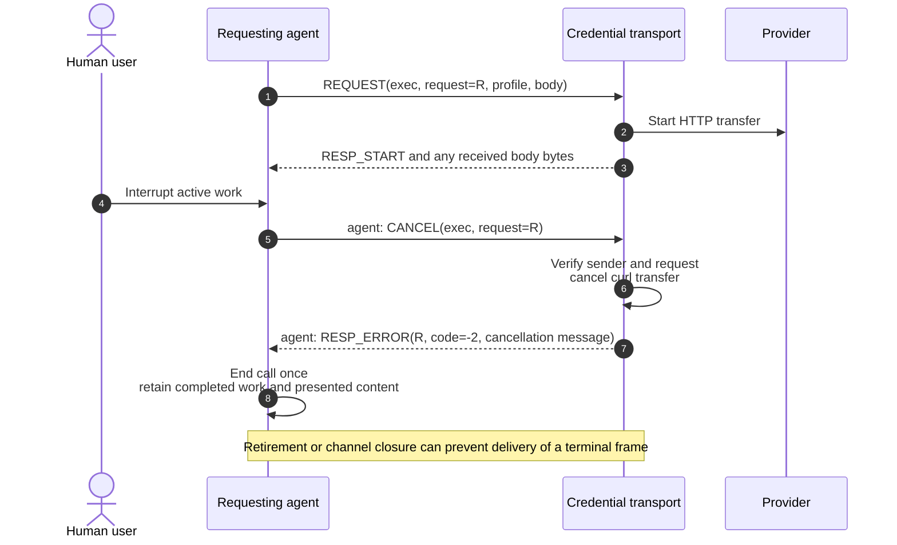
```mermaid
sequenceDiagram
    autonumber
    actor U as Human user
    participant M as Requesting agent
    participant T as Credential transport
    participant P as Provider
    M->>T: REQUEST(exec, request=R, profile, body)
    T->>P: Start HTTP transfer
    T-->>M: RESP_START and any received body bytes
    U->>M: Interrupt active work
    M->>T: agent: CANCEL(exec, request=R)
    T->>T: Verify sender and request<br/>cancel curl transfer
    T-->>M: agent: RESP_ERROR(R, code=-2, cancellation message)
    M->>M: End call once<br/>retain completed work and presented content
    Note over M,T: Retirement or channel closure can prevent delivery of a terminal frame
```

Retries belong to the agent engine. The transport performs no rate-limit
backoff or automatic replay. It sends HTTP status, `Retry-After`, rate-limit
headers, and transport-error details so that the engine can use the existing
retry rules. Each retry is a new transport request ID. A parsed transient
provider stream error is also an agent-engine decision.

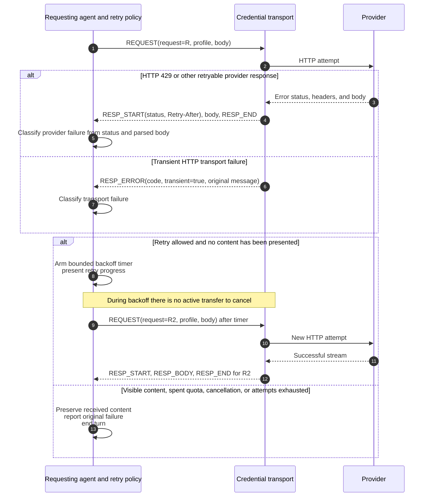
```mermaid
sequenceDiagram
    autonumber
    participant A as Requesting agent and retry policy
    participant T as Credential transport
    participant P as Provider
    A->>T: REQUEST(request=R, profile, body)
    T->>P: HTTP attempt
    alt HTTP 429 or other retryable provider response
        P-->>T: Error status, headers, and body
        T-->>A: RESP_START(status, Retry-After), body, RESP_END
        A->>A: Classify provider failure from status and parsed body
    else Transient HTTP transport failure
        T-->>A: RESP_ERROR(code, transient=true, original message)
        A->>A: Classify transport failure
    end
    alt Retry allowed and no content has been presented
        A->>A: Arm bounded backoff timer<br/>present retry progress
        Note over A,T: During backoff there is no active transfer to cancel
        A->>T: REQUEST(request=R2, profile, body) after timer
        T->>P: New HTTP attempt
        P-->>T: Successful stream
        T-->>A: RESP_START, RESP_BODY, RESP_END for R2
    else Visible content, spent quota, cancellation, or attempts exhausted
        A->>A: Preserve received content<br/>report original failure<br/>end turn
    end
```

A lost transport channel ends outstanding client calls as transport loss.
The client does not open a direct curl connection to recover service. This
is different from a live transport returning a transient provider connection
failure, which the agent can retry through that same transport.

### 5.5 Configuration, status, reload, and configured credentials

The source `oauth:chatgpt` names the subscription login. Only the transport
reads its store. Before a request reads the token, the transport checks the
expiry. A token near expiry starts one refresh, and each request that needs
it waits. The waiting request keeps a copy of its payload and runs again when
the refresh ends. A request that waited never starts a second refresh, so a
login that cannot be refreshed ends each waiting request with an error.
A cancel or a channel close removes a waiting request. The login must hold a
registration that authorizes the plan; the transport sends only the bearer
token to the public Responses endpoint. The bootstrap names the source and
asks the transport with `probe`; no image of the run reads the store. A model
that the login cannot serve returns to the provider's own credential source.

The main process is the only writer of the profile set. Before a model
request, `fyai_transport_ensure()` checks the configuration generation and
selected profile names. With no relevant change, it sends no control message.
When configuration or provider selection requires new profiles, it sends
`profiles` with `merge: true`, then replaces its root grant with the accumulated
profile names. Sub-agents do not call this profile-update path.

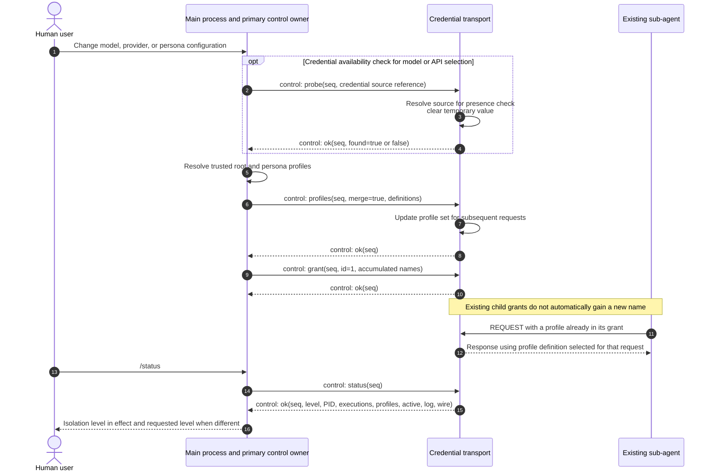
```mermaid
sequenceDiagram
    autonumber
    actor U as Human user
    participant M as Main process and primary control owner
    participant T as Credential transport
    participant A as Existing sub-agent
    U->>M: Change model, provider, or persona configuration
    opt Credential availability check for model or API selection
        M->>T: control: probe(seq, credential source reference)
        T->>T: Resolve source for presence check<br/>clear temporary value
        T-->>M: control: ok(seq, found=true or false)
    end
    M->>M: Resolve trusted root and persona profiles
    M->>T: control: profiles(seq, merge=true, definitions)
    T->>T: Update profile set for subsequent requests
    T-->>M: control: ok(seq)
    M->>T: control: grant(seq, id=1, accumulated names)
    T-->>M: control: ok(seq)
    Note over A,T: Existing child grants do not automatically gain a new name
    A->>T: REQUEST with a profile already in its grant
    T-->>A: Response using profile definition selected for that request
    U->>M: /status
    M->>T: control: status(seq)
    T-->>M: control: ok(seq, level, PID, executions, profiles, active, log, wire)
    M-->>U: Isolation level in effect and requested level when different
```

An in-flight transfer keeps the endpoint and settings it selected when it
started. A subsequent request uses the current profile definition. Existing
child grants keep their names; a parent must explicitly update a descendant's
grant to authorize a newly added name. Newly spawned children inherit their
parent's current names.

Prompt rendering obtains `{isolation}` from the local selected-level state;
it does not send a `status` request on every redraw. Explicit `/status` asks
the transport. Control waits occur for setup, configuration, child admission,
status, and credential checks. Regular streaming runs on the borrowed event
loop and agent data channels.

A reload is an `exec()` of the main process at the same PID. It keeps the
transport process, root registration, and both main transport endpoints.
Cleanup releases the client and control event source without shutting down
the transport. The new image attaches them again.

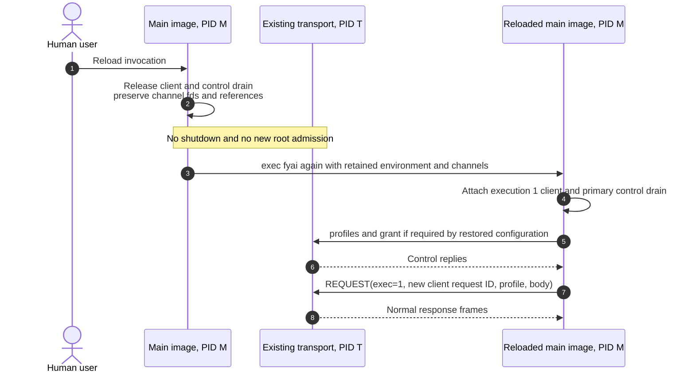
```mermaid
sequenceDiagram
    autonumber
    actor U as Human user
    participant M as Main image, PID M
    participant T as Existing transport, PID T
    participant N as Reloaded main image, PID M
    U->>M: Reload invocation
    M->>M: Release client and control drain<br/>preserve channel fds and references
    Note over M,T: No shutdown and no new root admission
    M->>N: exec fyai again with retained environment and channels
    N->>N: Attach execution 1 client and primary control drain
    N->>T: profiles and grant if required by restored configuration
    T-->>N: Control replies
    N->>T: REQUEST(exec=1, new client request ID, profile, body)
    T-->>N: Normal response frames
```

`envgrant` is an explicit exception for a command configured by the user,
such as catalogue update. The primary asks for environment-variable names,
not a provider profile. The transport writes available `NAME=VALUE` entries,
terminated by NUL bytes, into the supplied socket. The main process never
reads these bytes. Its command child reads them, installs them in its
environment, and executes the configured program. That program is permitted
to hold the granted values; this is not a credential grant to a model agent.

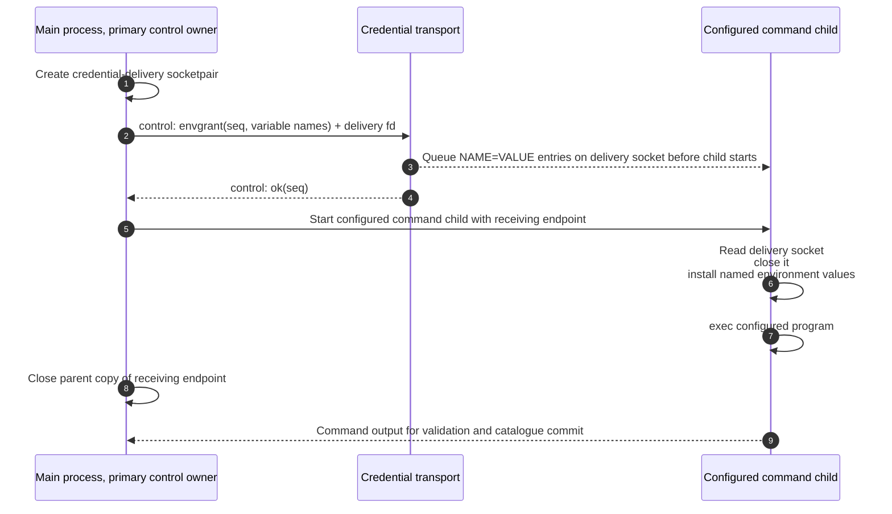
```mermaid
sequenceDiagram
    autonumber
    participant M as Main process, primary control owner
    participant T as Credential transport
    participant C as Configured command child
    M->>M: Create credential-delivery socketpair
    M->>T: control: envgrant(seq, variable names) + delivery fd
    T-->>C: Queue NAME=VALUE entries on delivery socket before child starts
    T-->>M: control: ok(seq)
    M->>C: Start configured command child with receiving endpoint
    C->>C: Read delivery socket<br/>close it<br/>install named environment values
    C->>C: exec configured program
    M->>M: Close parent copy of receiving endpoint
    C-->>M: Command output for validation and catalogue commit
```

The arrow into the command lifeline denotes bytes queued on its future
socket endpoint, not an already running child. `envgrant` reads only the
transport's environment for the requested names; it does not resolve
`mem:` or secret-store credentials. An empty set of available values produces
no credential entries. A secondary control connection is refused before any
value is sent.

### 5.6 The ChatGPT subscription login

The login is the credential source `oauth:chatgpt`. It follows the direct
token-sharing flow in `doc/chatgpt-auth.md`: a registered client, a PKCE
browser sign-in, and an access token for the public Responses endpoint. This
section states which process holds each secret.

| Secret | Holder | Never leaves |
| --- | --- | --- |
| Access token | Transport memory, for the time of a request | The transport. It is not in a profile, a reply, an event, or a log. |
| Refresh token, ID token | The login store, and transport memory during a refresh | The transport and the store. |
| Registration (client ID, host ID, subject) | The login store | Not a secret; `describe` and `status` can show it. |

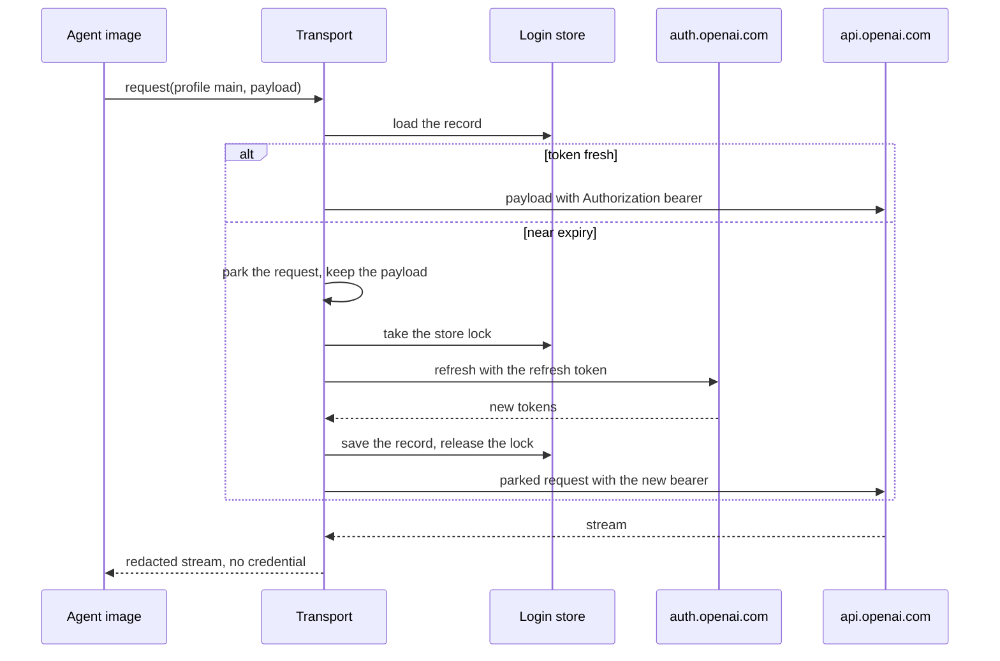
```mermaid
sequenceDiagram
    participant A as Agent image
    participant T as Transport
    participant S as Login store
    participant O as auth.openai.com
    participant P as api.openai.com
    A->>T: request(profile main, payload)
    T->>S: load the record
    alt token fresh
        T->>P: payload with Authorization bearer
    else near expiry
        T->>T: park the request, keep the payload
        T->>S: take the store lock
        T->>O: refresh with the refresh token
        O-->>T: new tokens
        T->>S: save the record, release the lock
        T->>P: parked request with the new bearer
    end
    P-->>T: stream
    T-->>A: redacted stream, no credential
```

The bootstrap does not read the store. It checks the configuration, names
`oauth:chatgpt` in the grant, and sends a `probe`. The transport answers only
`found`. A model that the login cannot serve (another provider, another
grammar, a custom `api_url`) falls back to the provider's own source; with
`auth: chatgpt` the bootstrap stops with the reason. The grant fixes the URL
to the public Responses endpoint. The agent cannot change URL, headers or
authentication, as for any profile.

What the transport protects:

- The transport reads the store for each request, so a login or logout by
  another process takes effect at the next request. A request with no usable
  login is refused and is not sent without authentication.
- The refresh runs in the transport on its event loop, under the store lock
  that the verbs use. Its endpoint is fixed in the code. A request that waits
  for the refresh keeps a copy of its payload and never starts a second
  refresh.
- The redactor learns the access token when the transport reads it. The token
  is whited out of the transport log and of any provider text that echoes it.
- The transport is undumpable, takes no listening socket, and forks no child
  after it has read a credential (section 6).

The commands of the login:

| Command | Where it runs | What it does with secrets |
| --- | --- | --- |
| `fyai auth login`, `logout`, `status`, `accounts` | A verb is its own process, with no transport. | It reads and writes the store itself. It is not an isolated run. |
| `/auth ...` in an isolated session | The agent image. | The same code runs in the agent image, so it loads tokens there. See the limits below. |
| `/usage`, `fyai auth usage` | The agent image. | It shows recorded token totals and a settings link. It reads no token and sends no request. |

A change made by `login` or `logout` reaches a running isolated session
through the store, because the transport reloads it. The session does not need
a restart.

Limits of this design, which section 7 repeats:

- Level B installs no filesystem policy. The store file (mode 0600, in the
  state directory of the user) is readable by a tool of the same user. The
  refresh token in it is the most valuable secret of the login. The transport
  keeps the token out of the agent image and the channel, but it cannot keep a
  tool from reading the file until the filesystem policy of section 6 exists.
  The keyring backend has the same property for a process that can reach the
  session bus.
- `/auth login`, `logout`, `status` and `accounts` in an isolated session load
  tokens into the agent image, and `logout` sends the revocation from there.
  They are commands of the user, not of the model, but they break the rule
  that the agent image holds no token. They should run in the transport or be
  refused in an isolated session.
- `status` reports the effective method as `api-key` when a transport exists,
  also when the login is the source.
- A 401 response is not retried, and the transport does not force a refresh
  after a rejection.

## 6. Credential and same-user process protection

The transport inherits the bootstrap environment, which can contain provider
keys. It hardens its process before it resolves or accepts credentials through
the protocol. It sets `PR_SET_DUMPABLE` to zero, disables core dumps, closes
unrelated inherited descriptors, and receives no raw key in its arguments. This prevents ordinary same-user inspection
of its process memory and sensitive proc entries; the design does not claim
protection from a privileged debugger or kernel compromise.

Credential source files and stores must also be inaccessible to agent and
tool processes. A key-free environment is insufficient if an agent can open
the same user's secret file. The complete protected-mode design therefore requires a
filesystem policy that denies those sources and the transport's private
state. Any user-authorized grant that exposes a credential source must be
treated as incompatible with the isolation guarantee, with a clear error.

The transport's network access is limited to its approved provider
endpoints. Agent and tool network policy is separate: an agent needs its IPC
channel, not direct provider TCP access. Linux cgroup membership is an
admission signal and resource boundary, not a network firewall by itself.

## 7. Implemented boundary and remaining work

This series implements the separate transport process, bootstrap and
sanitized main exec, agent data client, framed request server, root and
recursive child admission, profile and grant enforcement, status reporting,
reload handoff, and configured-command environment grants. Model transfers
use the shared transfer interface, and isolated sub-agents use exec. The
transport does not own conversation persistence or user presentation.

The following parts of the complete protected-mode design remain open:

- Level-A bootstrap must establish and protect a cgroup subtree before it
  enables that level. The low-level registry checks alone do not establish it.
- A filesystem policy must prevent agents and tools from opening credential
  sources and private transport logs. Scrubbing an environment does not
  prevent same-user secret-store access.
- Agent and tool network confinement must be enforced separately. Level-B
  sender checks do not stop arbitrary direct network access by tools.
- Auxiliary HTTP users, including MCP and OAuth, need an explicit integration
  and credential-ownership policy. Model transport isolation does not imply
  that those operations already use this transport.
- The login store is not denied to tools at level B (section 5.6), and the
  `/auth` commands of an isolated session handle tokens in the agent image.
- The ChatGPT login runs isolated, but model discovery reads the login store
  in the agent and is refused. It needs an egress profile. `/usage` shows
  recorded token totals and needs no credential.
- A 401 response to a login request is not retried. The transport refreshes a
  token that is near expiry before a request, but it does not refresh after a
  rejection.
- A secondary connection must preserve any optional model narrowing in its
  own grant when it admits or grants a descendant. Current control checks
  constrain profile names; they do not enforce that additional inheritance.
- Transient and pinned-root delegations need an executed-child state transfer
  before they can run isolated; the current path refuses the delegation.

These are limitations of the current level B, not reasons to skip admission,
expose a model key to a child, or fall back to direct model HTTP after loss of
the transport.

## 8. Failure and lifecycle

### 8.1 Child completion and retirement

Normal child completion returns its tool result and diagnostics to its parent
through job RPC. The parent collects the result and reaps the direct child.
The child's agent endpoint closes during cleanup or process exit. The
transport then retires its execution and cancels remaining transfers.
A secondary control connection closing removes that connection; it does not
shut down the transport or by itself retire the agent data registration.

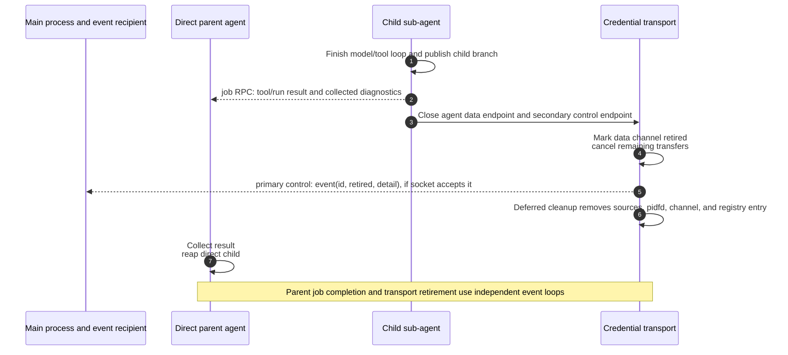
```mermaid
sequenceDiagram
    autonumber
    participant M as Main process and event recipient
    participant A as Direct parent agent
    participant D as Child sub-agent
    participant T as Credential transport
    D->>D: Finish model/tool loop and publish child branch
    D-->>A: job RPC: tool/run result and collected diagnostics
    D->>T: Close agent data endpoint and secondary control endpoint
    T->>T: Mark data channel retired<br/>cancel remaining transfers
    T-->>M: primary control: event(id, retired, detail), if socket accepts it
    T->>T: Deferred cleanup removes sources, pidfd, channel, and registry entry
    A->>A: Collect result<br/>reap direct child
    Note over A,T: Parent job completion and transport retirement use independent event loops
```

The diagram gives the causal dependencies, not a required delivery order
between the job result, process-exit notification, and retirement event. The
parent's result collection does not wait for a transport event. Event delivery
is best effort. An explicit authorized `retire(id)` takes the same data-channel
retirement path without waiting for the endpoint to close.

If an agent exits by signal or returns no job result, its parent reports how
the job ended through the existing tool diagnostics. If admission fails, the
parent withholds `tool/run`, terminates the waiting child, closes channels,
and reaps it. If malformed frames retire a channel while the agent is alive,
the client reports transport loss for its outstanding work.

### 8.2 Main shutdown and transport loss

The main process owns transport lifetime. Normal invocation teardown first
settles or cancels normal tool jobs and model work through their owners. Its
transport detach closes the root data client, removes the control drain,
attempts a nonblocking `shutdown` message, closes the primary connection,
and sends SIGTERM to and reaps its transport child. It does not wait for a
shutdown reply before the signal and reap. Transport SIGTERM and SIGHUP are
unblocked; their default actions can terminate the process.

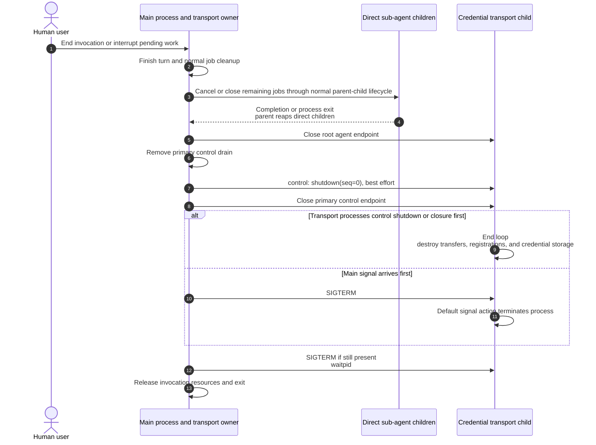
```mermaid
sequenceDiagram
    autonumber
    actor U as Human user
    participant M as Main process and transport owner
    participant A as Direct sub-agent children
    participant T as Credential transport child
    U->>M: End invocation or interrupt pending work
    M->>M: Finish turn and normal job cleanup
    M->>A: Cancel or close remaining jobs through normal parent-child lifecycle
    A-->>M: Completion or process exit<br/>parent reaps direct children
    M->>T: Close root agent endpoint
    M->>M: Remove primary control drain
    M->>T: control: shutdown(seq=0), best effort
    M->>T: Close primary control endpoint
    alt Transport processes control shutdown or closure first
        T->>T: End loop<br/>destroy transfers, registrations, and credential storage
    else Main signal arrives first
        M->>T: SIGTERM
        T->>T: Default signal action terminates process
    end
    M->>T: SIGTERM if still present<br/>waitpid
    M->>M: Release invocation resources and exit
```

Closure or failure of the primary connection stops the transport. Closure of
a secondary connection affects only that connection. The transport also arms
`PR_SET_PDEATHSIG` with SIGTERM, so loss of its parent can terminate it without
a control exchange. It is not a resident service, and reload is the explicit
exception that preserves it for another image of the same invocation.

A transport failure makes agent channels close. Clients end outstanding calls
as transport loss and report it through the normal turn or job path. Agents
cannot recover by resolving a key or switching to direct model curl. A live
transport can report an individual provider failure without ending the other
agents' channels. A dead registration, invalid frame, or closed data channel
cancels that channel's active requests; it does not require the whole
invocation's transport to stop.

No registration, transport execution ID, channel path, PID credential,
credential-delivery socket, or active transfer is stored in an arena. Only
normal canonical conversation, branch, configuration, and diagnostic results
persist. Reload references are process-local invocation state.

## 9. Verification plan

Verification must cover the implemented level-B boundary and the remaining
full protected-mode requirements. Items that require cgroup placement,
credential-source denial, or tool network confinement are acceptance criteria
for future level A, not claims made by the current level-B suite:

1. Root and recursive sub-agents stream model replies and cancel requests
   while carrying no provider key in environment, arguments, spawn frames,
   or process memory inherited from a key-bearing parent.
2. A tool given a copied agent socket descriptor cannot submit a request.
   A same-user process outside the invocation cannot register or submit one.
3. A process inside the cgroup but without the registered PID is rejected;
   a dead agent's registration cannot be reused after PID recycling.
4. A request naming a different URL, model, proxy, or authorization header is
   rejected. Redirects and proxy environment variables cannot change the
   selected provider endpoint.
5. The transport accepts only configured endpoints, https or loopback http, and
   validates TLS. A profile with no authentication receives no credential.
   With isolation turned on, the mock-provider cases of the functional suite
   pass unchanged.
6. A tool cannot read configured credential sources or reach the network
   under the protected policy. Failure to apply any required protection
   prevents startup.
7. Concurrent agents preserve event ordering, bounded buffering, retry and
   cancellation behavior, and branch publication semantics.

## 10. Optional macOS capabilities

The planned level-A mechanism in section 4.3 is the required full
protected-mode design.
macOS support is optional and must advertise its own verified guarantee. A
Unix socket plus `getpeereid()` or a process ID does not supply the Linux
combination of per-message sender credentials, pidfd identity, and cgroup
membership. It must not be labeled equivalent merely because a connection
was private when opened.

A macOS implementation could package the transport and agent runtime as
separately signed helpers and use an invocation-local XPC connection. The
transport would require the agent helper's code-signing identity on incoming
messages, then also require a supervisor-registered execution and request
grant. XPC's peer code-signing requirements are checked for received messages;
a valid signature alone identifies fyai code, not membership in this
particular agent tree. The supervisor must still control registration and
retire an execution when its process exits.

App Sandbox could confine the agent helper's filesystem and network access,
while a separately configured XPC transport retains provider access. The
agent helper and its tool children need a tested sandbox inheritance and
entitlement plan. Apple documents XPC services as the preferred privilege
separation mechanism for sandboxed apps; direct child processes inherit the
parent app's sandbox capabilities. This route implies signed, packaged
helpers and does not automatically apply to the current standalone CLI
distribution.

The sanitized agent `exec()` rule, no raw credential in agent data IPC,
trusted endpoint grants, and fail-closed behavior remain required on macOS.
Until packaging, peer identity, child-tool isolation, and credential source
protection have end-to-end tests, macOS runs must not claim the protected
mode described in this document.

Relevant Apple documentation: [XPC peer requirements](https://developer.apple.com/documentation/xpc/xpc_connection_set_peer_requirement),
[App Sandbox and helper tools](https://developer.apple.com/documentation/security/protecting-user-data-with-app-sandbox), and
[sandbox inheritance and XPC separation](https://developer.apple.com/library/archive/documentation/Miscellaneous/Reference/EntitlementKeyReference/Chapters/EnablingAppSandbox.html).

## 11. Open design decisions

- Whether the supervisor starts the bootstrap again under `systemd-run
  --user --scope` when the own cgroup is not writable, or only reports the
  failure. Section 4.3 describes the required subtree ownership.
- Whether tool children are moved to a sibling tool cgroup for clearer
  accounting. This is useful but does not replace PID checks.
- Whether a future design separates the current main process into a UI
  supervisor and a root-agent worker. The current ownership is described
  in section 3.1.
- Which auxiliary HTTP operations become egress profiles first. Sections 5.5
  and 7 describe the configured-command exception and remaining integration.
- Whether signed macOS packaging can provide the identity and confinement
  guarantees needed for an optional protected mode.

These decisions may refine the implementation, but none may weaken the
invariants in section 2.
