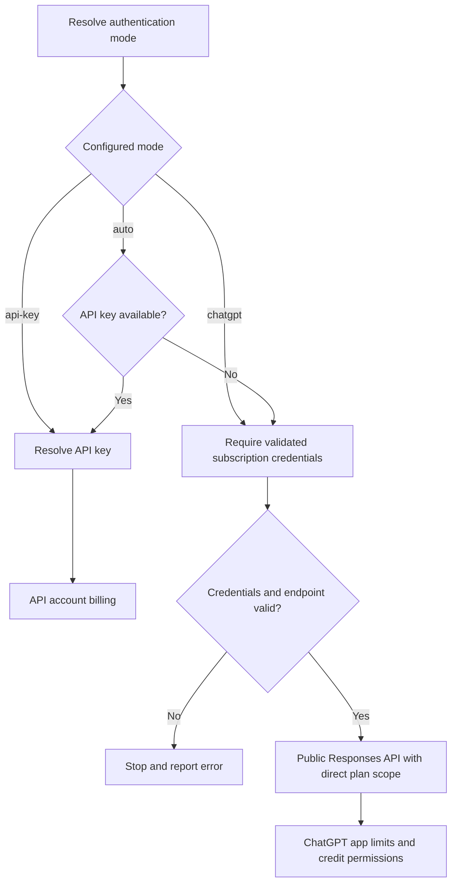
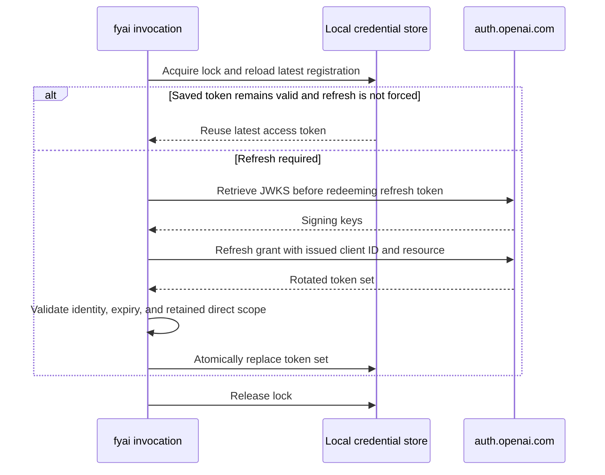

<!-- SPDX-License-Identifier: MIT -->

# ChatGPT subscription authentication

fyai uses OpenAI's direct token-sharing flow for local open-source clients.
The first login registers the client dynamically. There is no developer
console registration step, client secret, or borrowed Codex client ID.
This flow requires an eligible ChatGPT account and permission to use its plan.
See OpenAI's [sign-in contract](https://developers.openai.com/siwc/token-sharing-open-source/sign-in),
[token reference](https://developers.openai.com/siwc/token-sharing-open-source/token-reference),
and [preview limits](https://developers.openai.com/siwc/token-sharing-open-source/preview-limitations).

## Select the billing route

```sh
fyai auth openai login
fyai auth status
fyai config set auth chatgpt
```

`auth: auto` prefers an available API key, then uses a saved ChatGPT login.
`auth: api-key` selects API credentials. `auth: chatgpt` requires subscription
credentials and never falls back to an API key after an authorization,
refresh, or inference failure. A successful browser login alone does not change
the configured mode.



The granted `chatgpt.tokens.use.direct` scope authorizes the subscription route.
ChatGPT Settings can permit credit use after plan limits. Subscription access
therefore does not promise zero charges. `fyai auth usage` and `/usage` link to
[ChatGPT usage settings](https://chatgpt.com/settings/usage); they do not query
private usage endpoints. The implementation has mock coverage, but live account
eligibility and billing behavior require verification with the account in use.

## First registration and returning login

Before authorization, fyai saves a UUID host URI. It reuses this URI across
invocations and logout. The initial client ID is `dynamic_agent_client`.
OpenAI returns an issued client ID bound to the selected account or workspace.
fyai saves that registration before exchanging the code, so an exchange failure
does not lose the issued ID.

The browser request uses PKCE S256, state, an OIDC nonce, resource
`https://api.openai.com/v1`, and scopes `openid profile email offline_access
resource.invoke chatgpt.tokens.use.direct`. New registration also sends
`agent_name_hint=fyai` and the host URI. The exact loopback redirect URI is used
again in the token exchange. The receiver binds to `127.0.0.1` and tries ports
1455, 1457, then an available port.

```mermaid
sequenceDiagram
    actor User
    participant F as fyai invocation
    participant S as Local credential store
    participant O as auth.openai.com
    F->>S: Save or load stable host URI
    F->>F: Start loopback receiver; generate state, nonce, PKCE
    F->>User: Open authorization URL
    User->>O: Sign in and grant plan permission
    O-->>F: Callback with state, code, issued client ID
    F->>F: Check state and callback result
    F->>S: Retain pending issued registration
    F->>O: Exchange code with issued ID, verifier, redirect, resource
    O-->>F: Access, refresh, ID tokens, scope, expiry
    F->>O: Retrieve JWKS
    O-->>F: Signing keys
    F->>F: Verify identity and direct plan scope
    F->>S: Lock and atomically save validated token set
    F-->>User: Report active registration
```

ID token validation checks the RS256 signature, issuer, issued client audience,
expiry, issued-at time, optional not-before time, and login nonce. Returning
login and refresh must preserve the saved subject. A supplied authorized-party
claim must match the client ID. Missing direct plan permission is a failure.
Tokens are activated only after validation. A failed login does not replace
another active account's credentials.

```sh
fyai auth accounts
fyai auth login --account CLIENT_ID
fyai auth login --new-account
fyai auth login --no-browser
fyai auth login --manual
```

A returning login uses the saved issued client ID. fyai omits ID tokens from
printable authorization URLs. `--new-account` starts another registration.
`--no-browser` prints the URL while retaining the loopback receiver. CLI
`--manual` reads a complete pasted callback URL for a browser on another
machine; a bare code is rejected. Device-code login is unsupported. Legacy
Codex-compatible credentials require a new login.

## Inference

Subscription requests use `https://api.openai.com/v1/responses` with a bearer
token, `stream:true`, and `store:false`. fyai sends the full required history,
converts system input to developer input, and groups local function/custom tools
in the `fyai` namespace. Hosted web search remains a top-level tool. Native
shell and hosted MCP tools are unavailable through this path; local MCP tools
can be exposed as functions.

Custom endpoints and response chaining are rejected. Unsupported preview
parameters are omitted. Model discovery uses public `/v1/models` and preserves
the visible server ordering. Server-side compaction is disabled; context
compaction uses streamed summarization. See OpenAI's
[models and inference contract](https://developers.openai.com/siwc/token-sharing-open-source/models-and-inference)
and fyai's [compaction documentation](openai-compaction.md).

Plan-limit and eligibility errors stop the request without API-key fallback.
Transient provider failures follow the ordinary retry policy. A streamed
request is retried only before content has been presented.

## Refresh and concurrent invocations

Refresh uses the issued client ID and the same resource. A cross-process lock
protects rotation. Waiting for the lock uses timers in the invocation event
loop. After acquiring it, fyai reloads the latest saved credentials so another
invocation's completed rotation can be reused. It refreshes near expiry or
when a forced refresh is required.



A signing-key retrieval failure leaves the rotating refresh token unredeemed.
Refresh may retain the previous scope if the response omits it, but a narrowed
scope is rejected. Validation or refresh failure stops subscription use.

## Logout and storage

```mermaid
sequenceDiagram
    actor User
    participant F as fyai invocation
    participant S as Local credential store
    participant O as auth.openai.com
    User->>F: auth logout
    F->>S: Acquire lock and load active registration
    F->>O: Discover revocation endpoint
    F->>O: Attempt refresh-token revocation with issued client ID
    O-->>F: Revocation result or failure
    F->>S: Clear active tokens; retain host and registration identity
    F->>S: Release lock
    F-->>User: Report local logout and any unconfirmed revocation
```

Remote revocation is best effort. Local logout clears the active access,
refresh, and ID tokens, scope, and expiry even if remote revocation cannot be
confirmed. It retains the host URI and issued client ID for returning login.
Other saved registrations remain intact.

Secrets live in the machine-local credential store, never in canonical arenas
or model tool arguments. The existing platform backends are macOS Keychain,
optional Linux Secret Service, and an atomic mode-0600 file at
`$XDG_STATE_HOME/fyai/auth.json` or `~/.local/state/fyai/auth.json`. Each issued
client ID has a separate registration record. The host URI is shared on this
host. This storage is an explicit exception to arena-only persistence.

All authorization, lock waits, refresh, and cancellation run within the current
invocation. There is no daemon. Isolated supervised bootstrap does not support
ChatGPT login; see the [transport limitations](agent-transport-isolation-sdd.md).
[MCP OAuth](mcp-oauth.md) shares browser-flow helpers but has different client
registration and logout rules.
